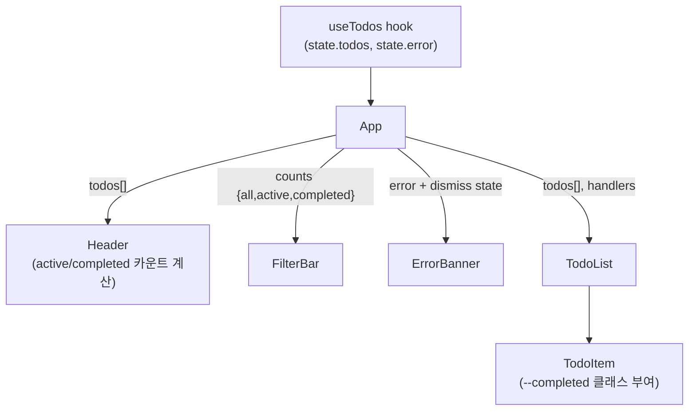

# Frontend 테마 리디자인 — 설계 문서

- **작성일**: 2026-04-30
- **위치**: `tutorials-go/ai/superpowers/todo/frontend/`
- **목적**: 현재의 너무 단순한 시각 테마(11줄 `index.css` + system 폰트)를 Minimalist+ × Indigo × Pretendard 방향으로 리디자인하여 시각적 위계와 완성도를 보강한다.
- **상태**: 설계 확정 (구현 미착수)

---

## 1. 목적과 범위

### 1.1 목적

현행 `index.css`는 11줄로 폰트와 본문 폭만 지정한다. 마크업도 클래스 없이 element만 쓰여 시각 위계가 거의 없고 priority/완료 상태가 색이나 강조로 구분되지 않는다. 본 리디자인은 이 시각 부족을 해소하면서도 학습 샘플 본질(외부 의존성 최소, 명시적 코드)을 유지한다.

### 1.2 스코프

**포함**

- 디자인 토큰(컬러/타이포/스페이싱/라디우스/섀도우)을 `:root` CSS 변수로 정의
- Pretendard 웹폰트 도입 (CDN `<link>`)
- 컴포넌트별 CSS 클래스 명명 + 단일 `index.css`에 스타일 작성
- Header 우측 상태 카운트 ("N개 진행 중 · M개 완료") — 작은 JSX 추가
- FilterBar를 segmented control 시각으로 (단 접근성 위해 radio input 유지)
- FilterBar 각 옵션에 카운트 뱃지 inline ("전체 (3)", "미완료 (2)", "완료 (1)")
- TodoForm을 흰색 카드 안에 inline 배치
- TodoList를 카드 컨테이너 + 항목 구분선으로 정리
- TodoItem 시각 보강: priority 뱃지 색상 정책, 완료 항목 line-through+회색, 마감일 작은 글씨 subtext, hover 상태
- 에러 배너 dismiss 버튼 추가
- 빈 상태 카드 dashed border + 중앙 정렬

**의도적 제외 (YAGNI)**

- 다크모드 (`color-scheme: light dark` 선언만 유지, 스타일 X) — 향후 별개 작업
- 외부 컴포넌트 라이브러리 (Tailwind, MUI, Radix 등)
- CSS Modules 분리 — 5 컴포넌트 규모에 과함
- 애니메이션/트랜지션 (CSS hover transition 0.15s 정도 외엔 X)
- 사용자 환경설정(테마/폰트 토글)
- 아이콘 라이브러리 (현재 텍스트 "×" 등은 유지)
- 반응형 모바일 레이아웃 (현재 max-width 580px만 적용)

### 1.3 성공 기준

- 시각: 테마 적용 후 mockup과 사실상 동일한 화면이 dev 서버에서 렌더됨
- 회귀: 기존 12개 unit 테스트 + 9개 e2e 시나리오가 모두 PASS
- 접근성: 모든 인터랙티브 요소가 키보드로 조작 가능, focus visible ring 적용
- 학습 ethos: 외부 의존성은 Pretendard CDN `<link>` 1줄 외에 추가 없음
- README "테마" 섹션이 디자인 토큰 + 변경 의도를 1쪽 분량으로 설명

---

## 2. 디자인 방향

| 축 | 결정 |
|---|---|
| 무드 | Minimalist+ (현재의 정제 버전, 차분 그레이 + 절제된 강조) |
| 다크 | 라이트 only (다크는 향후 별도) |
| 강조색 | Indigo (`#6366f1`) |
| 타이포 | Pretendard (한국어/영문 일관, CDN) |
| 구현 | 단일 `src/index.css` + `:root` 변수 토큰 |

---

## 3. 디자인 토큰

`src/index.css`의 `:root`에 다음 변수를 정의한다.

### 3.1 색상

```css
:root {
  /* Surface (배경, 카드, 보더) */
  --color-bg:           #fafafa;
  --color-surface:      #ffffff;
  --color-border:       #e4e4e7;
  --color-border-soft:  #f4f4f5;

  /* Text */
  --color-text:         #18181b;
  --color-text-strong:  #0a0a0a;
  --color-text-muted:   #71717a;
  --color-text-subtle:  #a1a1aa;

  /* Accent */
  --color-accent:       #6366f1; /* indigo-500 */
  --color-accent-hover: #4f46e5; /* indigo-600 */
  --color-accent-soft:  #eef2ff; /* indigo-50  */
  --color-accent-on-soft:#4338ca; /* indigo-700 */
  --color-accent-ring:  rgba(99,102,241,0.18);

  /* Priority */
  --color-priority-high-bg:   #fef2f2;
  --color-priority-high-fg:   #b91c1c;
  --color-priority-medium-bg: var(--color-accent-soft);
  --color-priority-medium-fg: var(--color-accent-on-soft);
  --color-priority-low-bg:    var(--color-border-soft);
  --color-priority-low-fg:    var(--color-text-muted);

  /* Error */
  --color-error-bg:     #fef2f2;
  --color-error-border: #fecaca;
  --color-error-fg:     #991b1b;
}
```

### 3.2 타이포

```css
:root {
  --font-sans: 'Pretendard Variable', Pretendard, system-ui, -apple-system,
               'Apple SD Gothic Neo', 'Malgun Gothic', sans-serif;

  --text-xs:   11px;
  --text-sm:   12px;
  --text-base: 14px;
  --text-lg:   18px;
  --text-xl:   22px;

  --leading-tight:  1.25;
  --leading-normal: 1.5;
  --leading-loose:  1.7;

  --tracking-tight: -0.02em;
}
```

Pretendard는 `index.html`의 `<head>`에 CDN `<link>` 추가:

```html
<link rel="stylesheet" href="https://cdn.jsdelivr.net/gh/orioncactus/pretendard@v1.3.9/dist/web/static/pretendard.min.css">
```

### 3.3 스페이싱 / 라디우스 / 섀도우

```css
:root {
  --space-1:  4px;
  --space-2:  8px;
  --space-3:  12px;
  --space-4:  16px;
  --space-5:  20px;
  --space-6:  24px;
  --space-8:  32px;

  --radius-sm: 5px;
  --radius-md: 8px;
  --radius-lg: 10px;

  --shadow-sm: 0 1px 2px rgba(0,0,0,0.06);
  --shadow-md: 0 1px 3px rgba(0,0,0,0.04);
}
```

### 3.4 base

```css
:root {
  color-scheme: light;
}

* { box-sizing: border-box; }

body {
  margin: 0;
  padding: var(--space-6);
  max-width: 580px;
  margin-inline: auto;
  background: var(--color-bg);
  color: var(--color-text);
  font-family: var(--font-sans);
  font-size: var(--text-base);
  line-height: var(--leading-normal);
}

button { font-family: inherit; cursor: pointer; }
input, select { font-family: inherit; }

:focus-visible {
  outline: 2px solid var(--color-accent);
  outline-offset: 2px;
  border-radius: var(--radius-sm);
}
```

---

## 4. 컴포넌트 사양

각 컴포넌트는 명시적 CSS 클래스를 부여받는다 (BEM 변형: 컴포넌트 단위 접두어 + 수식어 `--variant`).

### 4.1 App / Header

```html
<main class="app">
  <header class="app-header">
    <h1 class="app-title">Todo</h1>
    <span class="app-status">2개 진행 중 · 1개 완료</span>
  </header>
  <!-- error banner, form, filter, list -->
</main>
```

```css
.app-header {
  display: flex;
  align-items: baseline;
  justify-content: space-between;
  margin-bottom: var(--space-5);
}
.app-title {
  margin: 0;
  font-size: var(--text-xl);
  font-weight: 700;
  letter-spacing: var(--tracking-tight);
  color: var(--color-text-strong);
}
.app-status {
  font-size: var(--text-sm);
  color: var(--color-text-muted);
}
```

**`app-status` 카운트는 App.tsx에서 useTodos의 `todos`로부터 계산** — `active = todos.filter(!completed).length`, `completed = todos.length - active`. 둘 다 0이면 표시 생략.

### 4.2 TodoForm

```html
<form class="todo-form" aria-label="새 할일 추가">
  <input class="todo-form__input" aria-label="제목" ...>
  <select class="todo-form__priority" aria-label="우선순위">...</select>
  <input class="todo-form__due" type="datetime-local" aria-label="마감일">
  <button class="todo-form__submit" type="submit">추가</button>
</form>
```

```css
.todo-form {
  display: flex;
  gap: var(--space-2);
  margin-bottom: var(--space-4);
  padding: var(--space-3);
  background: var(--color-surface);
  border: 1px solid var(--color-border);
  border-radius: var(--radius-lg);
}
.todo-form__input,
.todo-form__priority,
.todo-form__due {
  padding: 9px 12px;
  border: 1px solid var(--color-border);
  border-radius: var(--radius-md);
  font-size: var(--text-base);
  background: var(--color-surface);
  outline: none;
}
.todo-form__input { flex: 1; }
.todo-form__input:focus { border-color: var(--color-accent); box-shadow: 0 0 0 3px var(--color-accent-ring); }
.todo-form__submit {
  background: var(--color-accent);
  color: white;
  border: 0;
  border-radius: var(--radius-md);
  padding: 9px var(--space-4);
  font-weight: 500;
  transition: background-color 0.15s;
}
.todo-form__submit:hover:not(:disabled) { background: var(--color-accent-hover); }
.todo-form__submit:disabled { background: var(--color-text-subtle); cursor: not-allowed; }
```

**JSX 변경**: `dueDate` 입력은 mockup상 폼 안에서는 생략 가능하나, 기존 코드와 e2e 테스트 호환을 위해 유지. 시각적으로 길이를 살짝 줄여 4 요소가 한 줄에 맞도록.

### 4.3 FilterBar — segmented control + 카운트 + 정렬

**핵심 결정**: 시각은 segmented control(필 토글), 마크업은 **radio input + label** 그대로 유지. 이유:
- 접근성: "셋 중 하나" 의미를 라디오가 정확히 전달
- 회귀 비용: 기존 `getByLabel('전체'|'미완료'|'완료')` 테스트가 그대로 동작
- 트릭: `<input type="radio">`를 `position: absolute; opacity: 0`로 숨기고 `<label>`을 pill 버튼처럼 스타일

```html
<div class="filter-bar" role="toolbar" aria-label="필터/정렬">
  <fieldset class="filter-bar__segments">
    <legend class="visually-hidden">상태</legend>
    <label class="filter-bar__segment">
      <input type="radio" name="status" value="all" checked>
      <span class="filter-bar__segment-label">전체 <span class="filter-bar__count">3</span></span>
    </label>
    <label class="filter-bar__segment">
      <input type="radio" name="status" value="active">
      <span class="filter-bar__segment-label">미완료 <span class="filter-bar__count">2</span></span>
    </label>
    <label class="filter-bar__segment">
      <input type="radio" name="status" value="completed">
      <span class="filter-bar__segment-label">완료 <span class="filter-bar__count">1</span></span>
    </label>
  </fieldset>

  <div class="filter-bar__sort">
    <label>
      <span class="visually-hidden">정렬</span>
      <select aria-label="정렬">
        <option value="createdAt">생성일</option>
        <option value="dueDate">마감일</option>
        <option value="priority">우선순위</option>
      </select>
    </label>
    <button type="button" aria-label="정렬 방향 토글" class="filter-bar__order">↓</button>
  </div>
</div>
```

```css
.visually-hidden {
  position: absolute; width: 1px; height: 1px; padding: 0; margin: -1px;
  overflow: hidden; clip: rect(0,0,0,0); white-space: nowrap; border: 0;
}

.filter-bar { display: flex; align-items: center; gap: var(--space-3); margin-bottom: var(--space-4); }

.filter-bar__segments {
  display: flex;
  background: var(--color-border-soft);
  padding: 3px;
  border-radius: var(--radius-md);
  border: 0;
  margin: 0;
}
.filter-bar__segment {
  position: relative;
  cursor: pointer;
}
.filter-bar__segment input[type="radio"] {
  position: absolute; opacity: 0; pointer-events: none;
}
.filter-bar__segment-label {
  display: inline-block;
  padding: 6px 14px;
  font-size: var(--text-sm);
  font-weight: 500;
  color: var(--color-text-muted);
  border-radius: 6px;
}
.filter-bar__segment input:checked + .filter-bar__segment-label {
  background: var(--color-surface);
  color: var(--color-text-strong);
  box-shadow: var(--shadow-sm);
}
.filter-bar__segment input:focus-visible + .filter-bar__segment-label {
  outline: 2px solid var(--color-accent);
  outline-offset: 1px;
}
.filter-bar__count {
  margin-left: 4px;
  font-size: 11px;
  color: inherit;
  opacity: 0.7;
}

.filter-bar__sort { margin-left: auto; display: flex; gap: var(--space-1); align-items: center; }
.filter-bar__sort select {
  padding: 5px 8px;
  border: 1px solid var(--color-border);
  border-radius: 6px;
  font-size: var(--text-sm);
  background: var(--color-surface);
}
.filter-bar__order {
  border: 1px solid var(--color-border);
  background: var(--color-surface);
  color: var(--color-text-muted);
  padding: 5px 9px;
  border-radius: 6px;
  font-size: var(--text-sm);
}
.filter-bar__order:hover { background: var(--color-border-soft); }
```

**카운트 prop 전달**: App에서 todos를 분류해 `{all, active, completed}` 카운트를 `<FilterBar>`에 prop으로 전달.

### 4.4 TodoList

```html
<ul class="todo-list" aria-label="할 일 목록">
  <TodoItem ... />
  <TodoItem ... />
</ul>

<!-- empty state -->
<div class="todo-list todo-list--empty">할 일이 없습니다.</div>
```

```css
.todo-list {
  list-style: none;
  margin: 0;
  padding: 0;
  background: var(--color-surface);
  border: 1px solid var(--color-border);
  border-radius: var(--radius-lg);
  overflow: hidden;
}
.todo-list--empty {
  text-align: center;
  padding: var(--space-8) var(--space-4);
  border-style: dashed;
  color: var(--color-text-subtle);
  font-size: var(--text-base);
}
```

### 4.5 TodoItem

```html
<li class="todo-item">
  <input type="checkbox" class="todo-item__checkbox" aria-label="완료" ...>
  <div class="todo-item__main">
    <span class="todo-item__title" onClick={...}>우유 사기</span>
    <!-- 또는 편집 모드 -->
    <input class="todo-item__title-edit" aria-label="제목 편집" ...>
    <span class="todo-item__due">마감 5월 15일 18:00</span>
  </div>
  <span class="todo-item__priority todo-item__priority--high">높음</span>
  <button class="todo-item__delete" aria-label="삭제">×</button>
</li>
```

```css
.todo-item {
  display: flex;
  align-items: center;
  gap: var(--space-3);
  padding: var(--space-3) var(--space-4);
  border-bottom: 1px solid var(--color-border-soft);
}
.todo-item:last-child { border-bottom: 0; }
.todo-item:hover { background: var(--color-border-soft); }

.todo-item__checkbox {
  width: 16px; height: 16px;
  accent-color: var(--color-accent);
  flex-shrink: 0;
}

.todo-item__main { flex: 1; min-width: 0; }
.todo-item__title {
  display: block;
  font-size: var(--text-base);
  color: var(--color-text);
  cursor: text;
  word-break: break-word;
}
.todo-item--completed .todo-item__title {
  color: var(--color-text-subtle);
  text-decoration: line-through;
}
.todo-item__title-edit {
  width: 100%;
  border: 1px solid var(--color-accent);
  border-radius: var(--radius-sm);
  padding: 4px 6px;
  font-size: var(--text-base);
  outline: none;
  box-shadow: 0 0 0 3px var(--color-accent-ring);
}
.todo-item__due {
  display: block;
  font-size: 11px;
  color: var(--color-text-subtle);
  margin-top: 2px;
}

.todo-item__priority {
  font-size: var(--text-xs);
  padding: 3px 8px;
  border-radius: var(--radius-sm);
  font-weight: 500;
  flex-shrink: 0;
}
.todo-item__priority--high   { background: var(--color-priority-high-bg);   color: var(--color-priority-high-fg);   }
.todo-item__priority--medium { background: var(--color-priority-medium-bg); color: var(--color-priority-medium-fg); }
.todo-item__priority--low    { background: var(--color-priority-low-bg);    color: var(--color-priority-low-fg);    }

.todo-item__delete {
  background: transparent;
  border: 0;
  color: var(--color-text-subtle);
  padding: 4px 6px;
  font-size: 16px;
  line-height: 1;
}
.todo-item__delete:hover { color: var(--color-priority-high-fg); }
```

**JSX 변경 사항**:
- 컨테이너에 조건부 클래스 `todo-item--completed` 추가 (`completed === true`일 때)
- priority 라벨 텍스트는 그대로지만 클래스에 `--high|--medium|--low` 수식어 동적 부여
- 마감일 표시: 현재의 `new Date(todo.dueDate).toLocaleString()` 그대로 유지. 별도 포맷 헬퍼는 본 스코프에서 제외 (사용자 로케일에 따라 자연스럽게 표시됨)

### 4.6 에러 배너

```html
<div class="error-banner" role="alert">
  <span class="error-banner__label">에러:</span>
  <span class="error-banner__message">서버에 연결할 수 없습니다</span>
  <button class="error-banner__close" aria-label="에러 닫기" onClick={...}>×</button>
</div>
```

```css
.error-banner {
  display: flex;
  align-items: center;
  gap: var(--space-2);
  padding: 10px 14px;
  margin-bottom: var(--space-4);
  background: var(--color-error-bg);
  border: 1px solid var(--color-error-border);
  border-radius: var(--radius-md);
  color: var(--color-error-fg);
  font-size: var(--text-base);
}
.error-banner__label { font-weight: 500; }
.error-banner__message { flex: 1; }
.error-banner__close { background: transparent; border: 0; color: inherit; padding: 0; font-size: 16px; line-height: 1; }
```

**App.tsx 변경**: `dismissedError`를 useState로 보관 (boolean, 기본 `false`). 닫기 버튼 클릭 시 `setDismissedError(true)`. **새로운 에러 발생 시 자동 reset**: `useEffect(() => { setDismissedError(false) }, [error])` — `useTodos`의 `error`가 변경되면 (새 메시지/null 전환 모두) dismissed 플래그를 리셋해 다음 에러는 다시 노출. 렌더 조건은 `error && !dismissedError`.

---

## 5. 접근성

- **focus-visible**: 모든 인터랙티브 요소에 `:focus-visible` 아웃라인 (3.4 base 참조). segmented control은 hidden radio + label 조합이라 `input:focus-visible + label`로 ring 적용.
- **role 유지**: 기존 `role="alert"`, `role="toolbar"`, `aria-label="할 일 목록"` 모두 유지.
- **시각적으로 숨김 + 의미 유지**: `<legend>`나 `<label>`을 화면에서 숨길 때 `display: none`이 아닌 `.visually-hidden` 사용 (스크린리더는 읽음).
- **색 대비**: priority 뱃지의 fg/bg 조합은 모두 WCAG AA(4.5:1) 이상을 목표로 한다. 채택한 조합 (high `#b91c1c on #fef2f2`, medium `#4338ca on #eef2ff`, low `#71717a on #f4f4f5`)은 모두 large-text 이상의 대비를 보이지만, 구현 단계에서 한 번 더 도구(예: WebAIM Contrast Checker)로 확인하고 미달 시 본 토큰 값을 조정한다.

---

## 6. 데이터 흐름 (변경 부분)



새로운 prop:
- `<FilterBar query counts={...} onChange />` — counts는 App에서 `useMemo`로 계산
- `<TodoItem todo onUpdate onRemove />` — 변경 없음 (CSS 클래스만 내부에서 부여)

---

## 7. 테스트 영향

### 7.1 기존 테스트 호환성

| 테스트 | 영향 |
|---|---|
| `App.test.tsx` (통합 시나리오) | 영향 없음 — `getByLabel('제목')`, `getByRole('button', {name:'추가'})`, `getByText('할 일이 없습니다.')`, `getByRole('alert')` 모두 유지 |
| `TodoItem.test.tsx` | 영향 없음 — 모든 라벨/role 유지. priority 텍스트 "낮음"/"보통"/"높음"도 유지 |
| `useTodos.test.ts` | 영향 없음 |
| e2e `todo.spec.ts` | 영향 없음 — `getByLabel('전체')`, `getByLabel('미완료')`, `getByLabel('완료')`는 hidden radio의 name과 매칭됨. 단 segmented control 변환 후 click 동작이 시각적으론 label에서 일어남 — playwright의 `getByLabel().check()`는 정상 동작 |

### 7.2 신규 테스트

- App: 헤더 상태 카운트가 todo 변화에 따라 갱신됨
- App: 에러 배너 닫기 버튼 클릭 시 배너 숨김
- FilterBar: 각 segment에 카운트 뱃지 노출
- E2E (선택): segmented control이 active 상태로 시각 전환됨 검증 (낮은 우선순위)

---

## 8. 구현 Phase 분해

| Phase | 작업 | 비고 |
|---|---|---|
| 0. 토큰 + Pretendard | `index.css` 토큰 정의, `index.html` `<link>` 추가, base 리셋 | 기존 11줄 CSS 대체 |
| 1. App + Header | App.tsx에 헤더 마크업, 카운트 계산 useMemo, 카운트 표시 | 신규 unit 테스트 1개 |
| 2. ErrorBanner | App.tsx에 dismiss 로컬 state, 배너 컴포넌트 분리 또는 inline JSX + 클래스 | 신규 unit 테스트 1개 |
| 3. TodoForm | 클래스 부여, 카드 컨테이너 스타일, 버튼 hover/disabled | 기존 테스트 통과 확인 |
| 4. FilterBar | segmented control 마크업 + CSS, count prop, sort select + order button 스타일 | 신규 unit 테스트 1개 |
| 5. TodoList + TodoItem | 카드 컨테이너, 항목 구분선, priority 색 뱃지, 완료 line-through, hover, 마감일 subtext | 기존 테스트 통과 확인 |
| 6. 회귀 검증 | unit 12개 + e2e 9개 모두 PASS, 빌드 OK, 브라우저 시각 확인 | — |
| 7. 문서 | README에 "테마" 섹션 추가 (디자인 토큰 + 변경 의도) | — |

각 Phase는 독립 commit. 7 phase × 1 commit 정도.

---

## 9. 다음 단계

1. 본 spec을 사용자가 검토 → 승인
2. `superpowers:writing-plans` skill로 phase별 상세 task로 분해
3. plan 작성 후 `subagent-driven-development`로 phase별 구현
