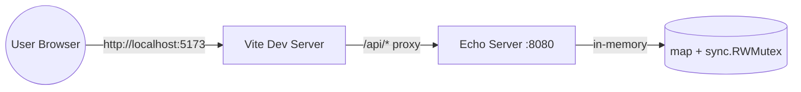
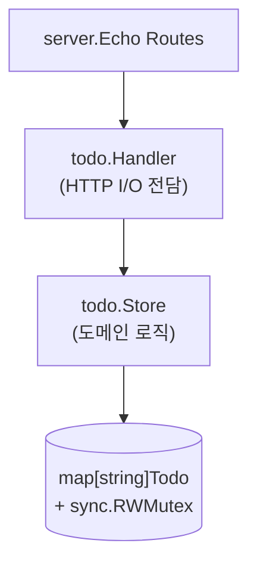

# Todo Web Application — 설계 문서

- **작성일**: 2026-04-30
- **위치**: `tutorials-go/ai/superpowers/todo/`
- **목적**: superpowers skill 사이클(brainstorm → plan → TDD → review)을 풀로 체험하기 위한 학습용 샘플 애플리케이션
- **Stack**: Go 1.26 (Echo), React 19 (Vite, TypeScript), in-memory persistence
- **상태**: 설계 확정 (구현 미착수)

---

## 1. 목적과 범위

### 1.1 목적

Todo 웹 애플리케이션을 처음부터 끝까지 만들면서, superpowers 플러그인의 다양한 skill을 자연스럽게 트리거하고 사용법을 익힌다. 부수적으로 다음을 학습한다.

- Go Echo + React/TypeScript 분리 아키텍처
- in-memory store의 동시성 안전 설계
- 서버 사이드 필터/정렬을 위한 query 파라미터 처리
- TDD 사이클 (Red → Green → Refactor) 의 실전 적용
- PATCH 엔드포인트에서 "필드 부재" vs "null 명시"를 구분하는 Go 패턴

### 1.2 기능 범위

**포함**

- Todo CRUD (생성/조회/수정/삭제/완료 토글)
- 상태 필터 (전체 / 미완료 / 완료)
- 우선순위 (low / medium / high)
- 마감일 (옵셔널, RFC3339)
- 정렬 (생성일 / 마감일 / 우선순위) × (asc / desc)
- 인라인 제목 편집

**의도적 제외 (YAGNI)**

- 사용자 인증/계정 — 학습 목적에 노이즈
- 영구 저장 (DB) — in-memory 컨셉
- 카테고리/태그 — 도메인 비대화
- 일괄 조작, 검색, 페이지네이션 — 복잡도 ↑
- 단일 항목 조회 (`GET /api/todos/{id}`) — UI 흐름에 불필요
- 낙관적 업데이트 — 학습 단순성 유지
- OpenAPI/타입 codegen — types.ts 수기 동기화로 충분

### 1.3 성공 기준

- 모든 Phase가 superpowers `executing-plans` skill로 체크포인트 통과
- `cd backend && go test -race ./... && go vet ./...` 무경고
- `cd frontend && npm test && npm run build` 무경고
- 사용자가 BE+FE 동시 실행 후 브라우저에서 CRUD 1 사이클을 끝낼 수 있음
- `superpowers:requesting-code-review` 결과 critical 이슈 0개

---

## 2. 시스템 아키텍처

### 2.1 프로세스 구조

두 프로세스 분리 운영. 단일 binary embed 방식은 채택하지 않는다.



| 모드 | 명령 | 포트 |
|---|---|---|
| Dev BE | `make dev-be` (`cd backend && go run .`) | 8080 |
| Dev FE | `make dev-fe` (`cd frontend && npm run dev`) | 5173 |
| Prod-like FE | `make preview-fe` (`vite preview`) | 4173 |

CORS는 `echo/middleware/cors` 가 `http://localhost:5173`, `http://localhost:4173` 을 허용한다 (Vite proxy 미사용 시나리오 대비).

### 2.2 디렉토리 레이아웃

```
tutorials-go/ai/superpowers/todo/
├── README.md
├── Makefile                        # dev-be / dev-fe / build / test / preview-fe
├── backend/
│   ├── main.go                     # 진입점 (server.New + Start)
│   ├── server/
│   │   ├── server.go               # Echo 인스턴스, 라우팅, 미들웨어(logger/recover/cors)
│   │   └── server_test.go          # 통합 (httptest.NewServer)
│   └── todo/                       # package todo (도메인)
│       ├── todo.go                 # Priority, Todo, NewTodo, Patch, Validate, ValidationError, ErrNotFound
│       ├── todo_test.go            # 검증 TDD
│       ├── store.go                # InMemoryStore (sync.RWMutex)
│       ├── store_test.go           # CRUD + 동시성 + 필터/정렬 TDD
│       ├── handler.go              # Echo 핸들러
│       └── handler_test.go         # 핸들러 TDD (httptest)
├── frontend/
│   ├── package.json
│   ├── vite.config.ts              # /api/* → http://localhost:8080 proxy
│   ├── tsconfig.json
│   ├── index.html
│   └── src/
│       ├── main.tsx
│       ├── App.tsx
│       ├── api.ts                  # 타입 안전 fetch wrapper
│       ├── types.ts                # Todo, NewTodo, Patch, Priority, Query
│       ├── components/
│       │   ├── TodoList.tsx
│       │   ├── TodoItem.tsx
│       │   ├── TodoForm.tsx
│       │   └── FilterBar.tsx
│       ├── hooks/
│       │   └── useTodos.ts         # useReducer + API 호출 캡슐화
│       ├── index.css               # 단일 CSS 파일
│       └── __tests__/
│           ├── App.test.tsx        # MSW로 API mock + 통합 시나리오
│           └── TodoItem.test.tsx
└── docs/superpowers/
    ├── specs/2026-04-30-todo-app-design.md   # 본 문서
    └── plans/2026-04-30-todo-app-plan.md     # writing-plans 산출물 (다음 단계)
```

**Go 모듈**: `tutorials-go` 루트 `go.mod`(`go 1.26.0`)를 그대로 사용. import path는 `github.com/kenshin579/tutorials-go/ai/superpowers/todo/backend/{server,todo}`.

### 2.3 백엔드 레이어 분리



- **`server`**: Echo 인스턴스 구성, 미들웨어, 라우트 등록만. 도메인 무지.
- **`todo.Handler`**: HTTP I/O. 요청 파싱/검증, 응답 직렬화, 도메인 에러→HTTP 상태 매핑.
- **`todo.Store`**: 도메인 핵심. HTTP/JSON 모름. Go 타입만 받고 반환.

이 분리가 곧 TDD 단위가 된다.

---

## 3. 도메인 모델

### 3.1 Todo

```go
type Priority string

const (
    PriorityLow    Priority = "low"
    PriorityMedium Priority = "medium"
    PriorityHigh   Priority = "high"
)

type Todo struct {
    ID        string     `json:"id"`         // UUID v4 (서버 생성)
    Title     string     `json:"title"`      // 1-200자, trim 후 검증
    Completed bool       `json:"completed"`  // 기본 false
    Priority  Priority   `json:"priority"`   // 기본 medium
    DueDate   *time.Time `json:"dueDate"`    // 옵셔널, RFC3339 (UTC)
    CreatedAt time.Time  `json:"createdAt"`
    UpdatedAt time.Time  `json:"updatedAt"`
}
```

### 3.2 검증 규칙

| 필드 | 규칙 |
|---|---|
| `Title` | `strings.TrimSpace` 후 길이 1~200자. 빈 문자열 금지. |
| `Priority` | `low` / `medium` / `high` 중 하나. 부재 시 `medium` 기본값. |
| `DueDate` | 옵셔널. 있으면 RFC3339 파싱 가능해야 함. 과거 날짜 허용. |
| `ID` | 클라이언트 입력 무시. 서버가 `uuid.NewString()` 생성. |
| `CreatedAt`, `UpdatedAt` | 서버 설정. 클라이언트 입력 무시. |

### 3.3 입력/패치 모델

```go
type NewTodo struct {
    Title    string
    Priority Priority   // 빈 값이면 medium
    DueDate  *time.Time // nil 허용
}

type Patch struct {
    Title        *string    // nil이면 미변경
    Completed    *bool
    Priority     *Priority
    DueDate      *time.Time // 새 값 (Set + non-null)
    ClearDueDate bool       // true면 nil로 클리어 (JSON null 명시)
}
```

`Patch.DueDate`와 `Patch.ClearDueDate` 구분이 PATCH의 핵심. handler가 `map[string]json.RawMessage` 1차 디코딩으로 키 존재 여부를 판별한 후 채운다 (3.5 참조).

### 3.4 에러 타입

```go
var ErrNotFound = errors.New("todo not found")

type ValidationError struct {
    Field   string
    Message string
}

func (e *ValidationError) Error() string { return e.Message }
```

handler는 `errors.Is(err, ErrNotFound)` 와 `errors.As(err, &verr)` 로 분기.

### 3.5 PATCH 의미론

| 요청 본문 | 해석 | 결과 |
|---|---|---|
| `{}` | 변경 없음 | 400 `validation_failed` |
| `{"completed": true}` | completed만 변경 | 200 |
| `{"dueDate": null}` | 마감일 클리어 (`ClearDueDate=true`) | 200 |
| `{"dueDate": "2026-05-15T18:00:00Z"}` | 마감일 설정 | 200 |
| `{"priority": "urgent"}` | 잘못된 값 | 400 `validation_failed` |
| `{"title": null}`, `{"completed": null}`, `{"priority": null}` | null 허용되지 않는 필드 | 400 `validation_failed`, field=해당 키 |

**Null 정책**: `dueDate` 만 명시적 null을 받아들여 클리어. 그 외 모든 필드에서 null은 검증 에러. handler는 `json.RawMessage` 바이트가 `null` 인지 먼저 체크하고, 해당 필드가 nullable이 아니면 `*ValidationError` 반환.

**구현 패턴 (handler 안)**:

```go
var raw map[string]json.RawMessage
if err := c.Bind(&raw); err != nil { /* 400 invalid_json */ }

patch := Patch{}
if v, ok := raw["dueDate"]; ok {
    if string(bytes.TrimSpace(v)) == "null" {
        patch.ClearDueDate = true
    } else {
        var t time.Time
        if err := json.Unmarshal(v, &t); err != nil { /* 400 */ }
        patch.DueDate = &t
    }
}
// title, completed, priority도 같은 방식으로 키 존재 → unmarshal
```

이 패턴은 표준 Go idiom이며 table-driven 테스트로 풍부하게 검증 가능.

---

## 4. REST API

### 4.1 엔드포인트

| Method | Path | 설명 | 성공 응답 |
|---|---|---|---|
| `GET` | `/api/todos` | 목록 (필터/정렬) | 200 `[]Todo` |
| `POST` | `/api/todos` | 생성 | 201 `Todo` |
| `PATCH` | `/api/todos/{id}` | 부분 수정 | 200 `Todo` |
| `DELETE` | `/api/todos/{id}` | 삭제 | 204 (no body) |
| `GET` | `/api/health` | 헬스체크 | 200 `{"status":"ok"}` |

### 4.2 `GET /api/todos` 쿼리 파라미터

| Param | 값 | 기본값 |
|---|---|---|
| `status` | `all` / `active` / `completed` | `all` |
| `sort` | `createdAt` / `dueDate` / `priority` | `createdAt` |
| `order` | `asc` / `desc` | `desc` |

### 4.3 정렬 규칙

- `priority` 정렬: `low=1`, `medium=2`, `high=3`. asc는 low → high.
- `dueDate` 정렬: `nil`은 order 무관 **항상 마지막** (결정적 동작).
- 안정 정렬 (`sort.SliceStable`). 동일 키일 때 `createdAt asc`로 tie-break.

### 4.4 요청 본문 예시

```jsonc
// POST /api/todos
{ "title": "장보기", "priority": "high", "dueDate": "2026-05-15T18:00:00Z" }

// PATCH /api/todos/{id}
{ "completed": true }
```

### 4.5 에러 응답 (전 엔드포인트 통일)

```json
{
  "error": {
    "code": "validation_failed",
    "message": "title is required",
    "details": { "field": "title" }
  }
}
```

| HTTP | code | 상황 |
|---|---|---|
| 400 | `validation_failed` | 본문/쿼리 검증 실패 |
| 400 | `invalid_json` | JSON 파싱 실패 |
| 404 | `not_found` | 해당 id의 todo 없음 |
| 405 | `method_not_allowed` | Echo 자동 처리 |
| 500 | `internal_error` | 예기치 못한 에러 (메시지 마스킹) |

---

## 5. Store 동시성 설계

### 5.1 자료 구조

```go
type Store struct {
    mu    sync.RWMutex
    todos map[string]Todo // 값 타입 (포인터 X)
}
```

값 타입 사용 이유: `Get`/`List`가 값 복사로 반환되어 호출자가 mutate해도 store에 영향 없음. (포인터였다면 외부에서 store 내부를 변경할 수 있음.)

### 5.2 메서드 시그니처

```go
func (s *Store) Add(input NewTodo) Todo                       // 쓰기락
func (s *Store) Get(id string) (Todo, bool)                   // 읽기락
func (s *Store) Update(id string, p Patch) (Todo, error)      // 쓰기락 — ErrNotFound 가능
func (s *Store) Delete(id string) error                       // 쓰기락 — ErrNotFound 가능
func (s *Store) List(q Query) []Todo                          // 읽기락 + sort
```

- `Add`/`Update`는 ID/timestamp를 store가 채운다. 클라이언트 입력 ID는 무시.
- `List`는 락 안에서 슬라이스 build → 락 해제 → sort. 락 점유 시간 최소화.

### 5.3 동시성 보장

- 모든 mutation은 `mu.Lock()`, 모든 read는 `mu.RLock()`.
- 동시성 검증을 위한 전용 테스트:

```go
func TestStore_ConcurrentAddList(t *testing.T) {
    t.Parallel()
    s := NewStore()
    var wg sync.WaitGroup
    for i := 0; i < 100; i++ {
        wg.Add(1)
        go func(i int) {
            defer wg.Done()
            s.Add(NewTodo{Title: fmt.Sprintf("t-%d", i)})
        }(i)
    }
    // 동시에 List 반복 호출
    done := make(chan struct{})
    go func() {
        for {
            select {
            case <-done:
                return
            default:
                _ = s.List(Query{})
            }
        }
    }()
    wg.Wait()
    close(done)
    assert.Len(t, s.List(Query{}), 100)
}
```

Makefile의 test 타겟은 항상 `-race` 플래그를 켠다.

### 5.4 동시 mutation 정책

- 같은 id에 대한 동시 PATCH: **last-write-wins** (버전 필드 미도입). 학습 샘플 단순성 우선.
- 탭1이 DELETE 후 탭2가 PATCH: 탭2는 404 받음. 프론트엔드는 에러 배너 표시 + 자동 refetch로 화면 동기화.

---

## 6. 프론트엔드 설계

### 6.1 컴포넌트 트리

```
App
├── FilterBar            (status / sort / order 변경 → query 갱신)
├── TodoForm             (title, priority, dueDate → onCreate)
└── TodoList
    └── TodoItem[]       (체크박스 / 인라인 제목 편집 / 삭제)
```

- App = 상태 owner. `useTodos(query)` 호출, query는 자체 useState.
- 자식은 모두 presentational. props로 데이터 + callback. 자체 fetch 없음.

### 6.2 `useTodos` hook

```ts
type State = { todos: Todo[]; loading: boolean; error: string | null }

type Action =
  | { type: 'fetch_start' }
  | { type: 'fetch_success'; todos: Todo[] }
  | { type: 'fetch_error'; error: string }

function useTodos(query: Query) {
  const [state, dispatch] = useReducer(reducer, { todos: [], loading: false, error: null })

  useEffect(() => {
    dispatch({ type: 'fetch_start' })
    api.list(query)
      .then((todos) => dispatch({ type: 'fetch_success', todos }))
      .catch((err) => dispatch({ type: 'fetch_error', error: err.message }))
  }, [query.status, query.sort, query.order])

  const refetch = () => { /* 동일 로직 */ }

  return {
    ...state,
    create: async (input) => { await api.create(input); refetch() },
    update: async (id, patch) => { await api.update(id, patch); refetch() },
    remove: async (id) => { await api.remove(id); refetch() },
    refetch,
  }
}
```

**핵심 결정**: 모든 mutation 후 list 재호출. 서버 사이드 정렬/필터이기 때문에 mutation 결과가 현재 뷰에 머물지 빠질지 서버 의견이 정답이다. 클라이언트 추측은 일관성을 깬다. in-memory store라 latency 무시 가능.

### 6.3 API 클라이언트 (`api.ts`)

```ts
const BASE = '/api'

async function call<T>(path: string, init?: RequestInit): Promise<T> {
  const res = await fetch(BASE + path, {
    ...init,
    headers: { 'Content-Type': 'application/json', ...(init?.headers ?? {}) },
  })
  if (!res.ok) {
    const body = await res.json().catch(() => ({}))
    throw new ApiError(body.error?.code ?? 'unknown', body.error?.message ?? res.statusText)
  }
  return res.status === 204 ? (undefined as T) : res.json()
}

export class ApiError extends Error {
  constructor(public code: string, message: string) { super(message) }
}

export const api = {
  list:   (q: Query)                  => call<Todo[]>(`/todos?${new URLSearchParams(q as any)}`),
  create: (input: NewTodo)            => call<Todo>('/todos', { method: 'POST',   body: JSON.stringify(input) }),
  update: (id: string, patch: Patch)  => call<Todo>(`/todos/${id}`, { method: 'PATCH', body: JSON.stringify(patch) }),
  remove: (id: string)                => call<void>(`/todos/${id}`, { method: 'DELETE' }),
}
```

### 6.4 타입 동기화 정책

`types.ts`의 `Todo`/`NewTodo`/`Patch`/`Priority`/`Query` 는 백엔드 JSON 모델과 **수기 동기화**. README에 "BE 모델 변경 시 types.ts도 함께 수정" 주의문 명시. OpenAPI/codegen은 학습 노이즈로 도입하지 않는다.

### 6.5 UI 명세

| 컴포넌트 | 표시 요소 | 인터랙션 |
|---|---|---|
| `TodoForm` | title input, priority select, dueDate input(`datetime-local`, optional) | Enter 또는 Add 버튼 → onCreate, 성공 시 입력 클리어 |
| `FilterBar` | status 라디오(All/Active/Completed), sort 셀렉트, order 토글 (↑/↓) | 변경 즉시 query 갱신 → useEffect로 자동 refetch |
| `TodoItem` | 체크박스, 제목(클릭→편집), priority 뱃지(색상), dueDate 표시(있을 때), 삭제 버튼 | 체크 → onUpdate({completed}), 제목 blur/Enter → onUpdate({title}), 삭제 → onRemove |
| 에러 배너 | `state.error` 있을 때 상단 표시 | 닫기 버튼 |

### 6.6 타임존 처리

- 서버: 항상 UTC RFC3339로 저장/반환.
- 프론트: `datetime-local` 입력은 로컬 시간 → ISO 변환 후 전송. 표시는 `toLocaleString()`로 사용자 로케일 맞춤.

### 6.7 스타일링

순수 CSS 단일 파일 (`src/index.css`). Tailwind/CSS-in-JS 미도입.

---

## 7. 에러 처리 책임 분배

| 레이어 | 책임 |
|---|---|
| **Store** | 도메인 에러만 반환 (`ErrNotFound`, `*ValidationError`). HTTP 무지. panic 없음. |
| **Handler** | JSON 파싱 에러 → `400 invalid_json` / 도메인 에러 → `writeError` 헬퍼로 매핑 |
| **Echo middleware** | `Logger()` 모든 요청, `Recover()` panic 캡처 (500), `CORS` 프리플라이트 |
| **Frontend `api.ts`** | non-2xx → `ApiError(code, message)` throw / 네트워크 실패 → 일반 `Error` 통과 |
| **Frontend reducer** | `fetch_error` 액션 → 상태에 누적, UI 배너로 표시 |

`writeError` 헬퍼 (handler에서 한 곳만):

```go
// errBody는 4.5의 JSON 형태를 만든다.
func errBody(code, msg string, details map[string]any) echo.Map {
    body := echo.Map{"code": code, "message": msg}
    if details != nil {
        body["details"] = details
    }
    return echo.Map{"error": body}
}

func writeError(c echo.Context, err error) error {
    var verr *ValidationError
    switch {
    case errors.As(err, &verr):
        return c.JSON(400, errBody("validation_failed", verr.Message, map[string]any{"field": verr.Field}))
    case errors.Is(err, ErrNotFound):
        return c.JSON(404, errBody("not_found", err.Error(), nil))
    default:
        c.Logger().Error(err)
        return c.JSON(500, errBody("internal_error", "internal server error", nil))
    }
}
```

---

## 8. 엣지 케이스

| # | 시나리오 | 동작 | 검증 위치 |
|---|---|---|---|
| 1 | `title: "  "` (공백만) | trim 후 빈 문자열 → 400 validation_failed, field=title | store_test, handler_test |
| 2 | title 길이 201 | 400 validation_failed | handler_test (table) |
| 3 | `priority: "urgent"` | 400 validation_failed | handler_test |
| 4 | `dueDate: "2026-13-01"` | 400 validation_failed (RFC3339 parse 실패) | handler_test |
| 5 | dueDate 과거 | 허용 | todo_test |
| 6 | `PATCH {}` 빈 객체 | 400 validation_failed | handler_test |
| 7 | `PATCH {"dueDate": null}` | 마감일 클리어, 200 | handler_test |
| 8 | DELETE 없는 id | 404 not_found | handler_test |
| 9 | 동시 PATCH 같은 id | last-write-wins (README에 정책 명시) | (테스트 제외) |
| 10 | 탭1 DELETE, 탭2 PATCH | 탭2 = 404 → 배너 + 자동 refetch | App.test.tsx |
| 11 | 서버 재시작 | 데이터 전부 손실, refetch가 빈 목록 | README 명시 |
| 12 | DueDate 타임존 | 서버 UTC, FE는 datetime-local→ISO 변환 | helper |
| 13 | `?sort=invalid` | 400 validation_failed | handler_test |
| 14 | priority 정렬 + 동일 우선순위 | createdAt asc로 tie-break | store_test |
| 15 | dueDate 정렬 + nil 섞임 | nil 항상 마지막 | store_test |
| 16 | 네트워크 실패 (BE down) | api.ts throw → 배너 "서버에 연결할 수 없습니다" | App.test.tsx (MSW 시뮬) |

---

## 9. 테스트 전략

### 9.1 테스트 피라미드

- BE unit (todo 패키지): ~80% — 도메인 검증, store, handler
- BE integration (server 패키지): ~15% — httptest.NewServer로 풀 라우팅
- FE smoke (App + TodoItem): ~5%

### 9.2 백엔드 컨벤션

- **Table-driven** 우선 (검증, query 파싱, patch 의미론)
- **`t.Parallel()`** 모든 subtest
- **`go test -race ./...`** 가 Makefile 기본
- **Fresh store per test** (`newTestStore()` 헬퍼)
- **testify/assert** 채택 (`tutorials-go` 프로젝트 컨벤션 — `.claude/rules/testing.md`)
- **테스트 함수명 형식**: `TestXxx_설명` (예: `TestStore_ConcurrentAddList`, `TestHandler_Create_Returns400OnEmptyTitle`)
- **httptest.NewServer + 실제 라우터**로 server_test 1개

### 9.3 프론트엔드 컨벤션

- **MSW** (Mock Service Worker)로 fetch 가로채기
- **`render` + `userEvent`** (`fireEvent` 대신)
- **`findBy*`** (await) 비동기 렌더 대기

### 9.4 코드 스타일 (`.claude/rules/code-style.md` 준수)

- `gofmt` / `goimports` 적용 필수
- 에러는 즉시 처리 (`if err != nil { return err }` 패턴)
- 패키지 export 함수/타입에 GoDoc 주석 작성 (예: `Store`, `NewStore`, `Add`, `Validate`, `ErrNotFound` 등)
- 변수명은 짧고 관용적으로 (`err`, `ctx`, `req`, `resp`, `c` for echo.Context)
- 구조체 필드 태그는 `json` 우선 (`validate` 사용처 없음)

---

## 10. 구현 Phase 분해

writing-plans skill로 넘기기 위한 큰 그림. 각 Phase는 독립적으로 검증 가능한 단위.

| Phase | 작업 | TDD | 검증 |
|---|---|---|---|
| 0. Scaffold | backend 패키지 init, frontend Vite 셋업, Makefile, README 골격 | — | `go build ./...`, `npm run dev` 부팅 |
| 1. 도메인 모델 | `todo.go` (Priority, Todo, Validate, NewTodo, Patch, ValidationError, ErrNotFound) | ✅ Red→Green→Refactor | `go test ./backend/todo` |
| 2. Store | `store.go` (Add/Get/Update/Delete/List, mutex, sort) | ✅ + 동시성 | `go test -race ./backend/todo` |
| 3. Handler | `handler.go` (List/Create/Update/Delete + writeError) | ✅ httptest 단위 | handler_test 통과 |
| 4. Server 통합 | `server.go` (Echo, 미들웨어, 라우트) + main.go | 통합 1개 | server_test + `curl /api/health` |
| 5. FE 인프라 | `types.ts`, `api.ts`, MSW 핸들러, vite proxy | (선택) | `npm run dev` 부팅 + 콘솔 확인 |
| 6. useTodos hook | reducer + effect + actions | (선택) | hook 단독 테스트 |
| 7. 컴포넌트 | TodoForm, FilterBar, TodoItem, TodoList | smoke (TodoItem 1개) | App.test에서 통합 검증 |
| 8. App 통합 | App.tsx 조립 + App.test.tsx (MSW로 풀 시나리오) | ✅ 통합 1개 | `npm test` 통과 |
| 9. 통합 검증 | Makefile 마무리, README 완성, BE+FE 동시 실행 후 브라우저 CRUD 1 사이클 | — | 사람이 직접 |
| 10. Code review | `superpowers:requesting-code-review` 호출 | — | 코멘트 반영 |

### 10.1 superpowers skill 활용 매트릭스

| Phase | 트리거되는 skill |
|---|---|
| 모든 Phase 시작 | `verification-before-completion` (이전 phase done 정의 만족 확인) |
| Phase 1, 2, 3, 8 | `test-driven-development` (Red→Green→Refactor 명시 사이클) |
| Phase 7 (선택) | `dispatching-parallel-agents` (4개 컴포넌트 병렬 worktree) |
| 임의 phase 중 버그 | `systematic-debugging` (가설 → 격리 → 수정) |
| Phase 0 (선택) | `using-git-worktrees` (격리된 작업 공간) |
| Phase 10 | `requesting-code-review` |
| 전체 진행 | `executing-plans` (이 plan을 따라 phase별 체크포인트) |

### 10.2 Phase 간 검증 게이트

각 phase 완료 선언 전 의무 검증:

- **백엔드 phase**: `cd backend && go test -race ./... && go vet ./...`
- **프론트 phase**: `cd frontend && npm run build && npm test`
- **통합 phase**: BE + FE 동시 실행, 브라우저에서 CRUD 1 사이클

---

## 11. 의존성

### 11.1 백엔드

| 패키지 | 용도 |
|---|---|
| `github.com/labstack/echo/v4` | 웹 프레임워크 |
| `github.com/labstack/echo/v4/middleware` | logger, recover, CORS |
| `github.com/google/uuid` | UUID v4 생성 |
| `github.com/stretchr/testify/assert` (test only) | 어설션 (프로젝트 컨벤션) |

### 11.2 프론트엔드

| 패키지 | 용도 |
|---|---|
| `react`, `react-dom` | 19.x |
| `vite`, `@vitejs/plugin-react` | 빌드/dev |
| `typescript` | 5.x |
| `vitest`, `@vitest/ui` | 테스트 러너 |
| `@testing-library/react`, `@testing-library/user-event` | 컴포넌트 테스트 |
| `msw` | API 모킹 |
| `jsdom` | Vitest DOM 환경 |

---

## 12. 운영 관련 결정 사항

| 항목 | 결정 |
|---|---|
| 환경변수 | 사용 안 함. 포트는 코드 상수 + Makefile 변수로만 관리 (학습 노이즈 ↓) |
| 시작 순서 | BE 먼저, FE는 첫 fetch에서 BE 부재 시 에러 배너. README 명시 |
| 포트 충돌 | `BE_PORT=8080 FE_PORT=5173` 변수화, README에 변경 방법 명시 |
| 로깅 | BE는 `middleware.Logger()` 기본, 5xx는 stack trace. FE는 `console.error` 만 |
| 데이터 영속성 | 없음. 서버 재시작 시 전부 손실 (in-memory). README에 명시. |

---

## 13. 다음 단계

1. 본 spec을 사용자가 검토 → 승인
2. `superpowers:writing-plans` skill 호출로 위 Phase 분해를 상세 작업 단위 plan으로 변환
3. plan 작성 완료 후 `superpowers:executing-plans` 또는 `subagent-driven-development` 로 구현 진입
