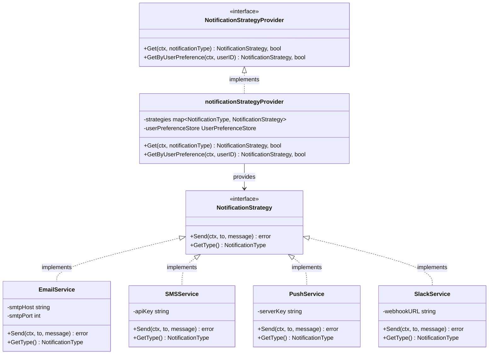

# Factory Pattern (팩토리 패턴) - Strategy Provider

## 목적

객체 생성 로직을 캡슐화하여 조건에 따라 적절한 객체를 제공합니다.

## 구조



## 파일 구성

| 파일 | 설명 |
|------|------|
| `main.go` | 실행 진입점 (예제 코드) |
| `notification/domain.go` | `NotificationStrategy`, `NotificationStrategyProvider` 인터페이스 정의 |
| `notification/email_service.go` | 이메일 알림 서비스 구현체 |
| `notification/sms_service.go` | SMS 알림 서비스 구현체 |
| `notification/push_service.go` | 푸시 알림 서비스 구현체 |
| `notification/slack_service.go` | Slack 알림 서비스 구현체 |
| `notification/provider.go` | Strategy Provider (Factory) 구현 |
| `notification/notification_usecase.go` | 알림 유스케이스 (Context) |
| `notification/user_preference_store.go` | 사용자 설정 저장소 (Mock) |

## 핵심 구성요소

- **Strategy Interface**: `NotificationStrategy` - 알림 전송 공통 인터페이스
- **Concrete Strategies**: `EmailService`, `SMSService`, `PushService`, `SlackService` - 구현체
- **Factory**: `NotificationStrategyProvider` - 조건에 따라 Strategy 제공
- **Context**: `NotificationUsecase` - Provider를 통해 Strategy를 얻어 사용
- **Configuration**: `UserPreferenceStore` - 사용자 알림 설정 저장소

## 사용 예제

```go
// 1. 각 알림 서비스 생성
emailService := NewEmailService("smtp.example.com", 587)
smsService := NewSMSService("api-key-xxx")
pushService := NewPushService("fcm-server-key")
slackService := NewSlackService("webhook-url")

// 2. Provider 생성 (여러 Service 등록)
provider := NewNotificationStrategyProvider(
    emailService,
    smsService,
    pushService,
    slackService,
    userPreferenceStore,
)

// 3. Usecase 생성
notificationUsecase := NewNotificationUsecase(provider)

// 4. 타입으로 직접 알림 전송
notificationUsecase.Send(ctx, NotificationTypeEmail, "user@example.com", "Hello!")

// 5. 사용자 설정에 따라 자동으로 Strategy 선택
notificationUsecase.SendByUserPreference(ctx, userID, "Your order has been shipped!")
```

## 패턴 적용의 장점

### 1. 확장성 (Open/Closed Principle)

새로운 알림 채널(카카오톡, 텔레그램 등)을 추가해도 기존 코드 수정 없이 새 Service만 구현하면 됩니다.

```go
// 새로운 알림 서비스 추가
type KakaoTalkService struct {
    apiKey string
}

func (s *KakaoTalkService) Send(ctx context.Context, to, message string) error {
    // 카카오톡 알림 전송 로직
}

func (s *KakaoTalkService) GetType() NotificationType {
    return NotificationTypeKakaoTalk
}

// Provider에 등록
strategies[NotificationTypeKakaoTalk] = kakaoTalkService
```

### 2. 유연한 Strategy 선택

조건에 따라 동적으로 적절한 Strategy를 선택할 수 있습니다.

```go
// 타입으로 직접 선택
strategy, ok := provider.Get(ctx, NotificationTypeEmail)

// 사용자 설정에 따라 자동 선택
strategy, ok := provider.GetByUserPreference(ctx, userID)
```

### 3. 테스트 용이성

각 Service와 Provider를 독립적으로 테스트할 수 있습니다.

```go
func TestEmailService(t *testing.T) {
    service := NewEmailService("smtp.test.com", 587)
    err := service.Send(ctx, "test@example.com", "Test message")
    assert.NoError(t, err)
}

func TestProvider(t *testing.T) {
    provider := NewNotificationStrategyProvider(emailService, ...)
    strategy, ok := provider.Get(ctx, NotificationTypeEmail)
    assert.True(t, ok)
    assert.Equal(t, NotificationTypeEmail, strategy.GetType())
}
```

## 실행

```bash
go run main.go
```
