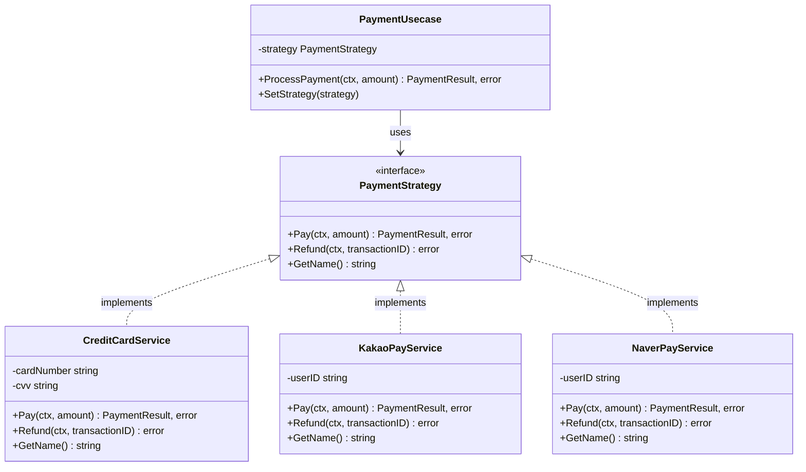

# Strategy Pattern (전략 패턴)

## 목적

알고리즘을 캡슐화하여 런타임에 교체할 수 있게 합니다.

## 구조



## 파일 구성

| 파일 | 설명 |
|------|------|
| `main.go` | 실행 진입점 (예제 코드) |
| `payment/domain.go` | `PaymentStrategy` 인터페이스 및 `PaymentResult` 타입 정의 |
| `payment/credit_card_service.go` | 신용카드 결제 서비스 구현체 |
| `payment/kakao_pay_service.go` | 카카오페이 결제 서비스 구현체 |
| `payment/naver_pay_service.go` | 네이버페이 결제 서비스 구현체 |
| `payment/payment_usecase.go` | 결제 유스케이스 (Context) |
| `payment/helper.go` | 헬퍼 함수 |

## 핵심 구성요소

- **Strategy Interface**: `PaymentStrategy` - 공통 인터페이스
- **Concrete Strategies**: `CreditCardService`, `KakaoPayService`, `NaverPayService` - 구현체
- **Context**: `PaymentUsecase` - Strategy를 사용하는 클라이언트

## 사용 예제

```go
// 1. Service 생성 (Strategy 구현체)
creditCardService := NewCreditCardService("1234-5678-9012-3456", "123")

// 2. Usecase에 Strategy 주입
paymentUsecase := NewPaymentUsecase(creditCardService)

// 3. 결제 처리
result, err := paymentUsecase.ProcessPayment(ctx, 50000)

// 4. 런타임에 Strategy 교체
kakaoPayService := NewKakaoPayService("user123")
paymentUsecase.SetStrategy(kakaoPayService)

// 5. 다른 결제 방식으로 처리
result, err = paymentUsecase.ProcessPayment(ctx, 30000)
```

## 패턴 적용의 장점

### 1. 확장성 (Open/Closed Principle)

새로운 결제 방식(토스페이 등)을 추가해도 기존 코드 수정 없이 새 Service만 구현하면 됩니다.

```go
// 새로운 결제 서비스 추가
type TossPayService struct {
    userID string
}

func (s *TossPayService) Pay(ctx context.Context, amount int) (PaymentResult, error) {
    // 토스페이 결제 로직
}

func (s *TossPayService) Refund(ctx context.Context, transactionID string) error {
    // 환불 로직
}

func (s *TossPayService) GetName() string {
    return "TossPay"
}
```

### 2. 런타임 교체

조건에 따라 동적으로 알고리즘 변경이 가능합니다.

```go
if user.IsVIP {
    paymentUsecase.SetStrategy(premiumPaymentService)
} else {
    paymentUsecase.SetStrategy(standardPaymentService)
}
```

### 3. 테스트 용이성

각 Service를 독립적으로 테스트할 수 있습니다.

```go
func TestCreditCardService(t *testing.T) {
    service := NewCreditCardService("1234-5678-9012-3456", "123")
    result, err := service.Pay(ctx, 10000)
    assert.NoError(t, err)
    assert.Equal(t, "SUCCESS", result.Status)
}
```

## 실행

```bash
go run main.go
```
