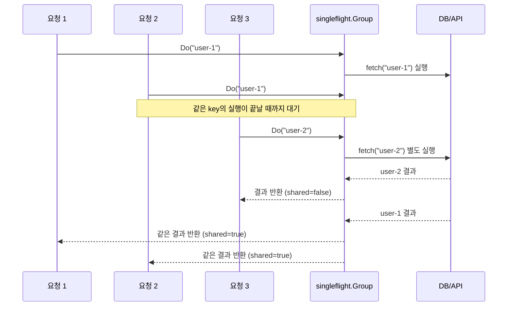
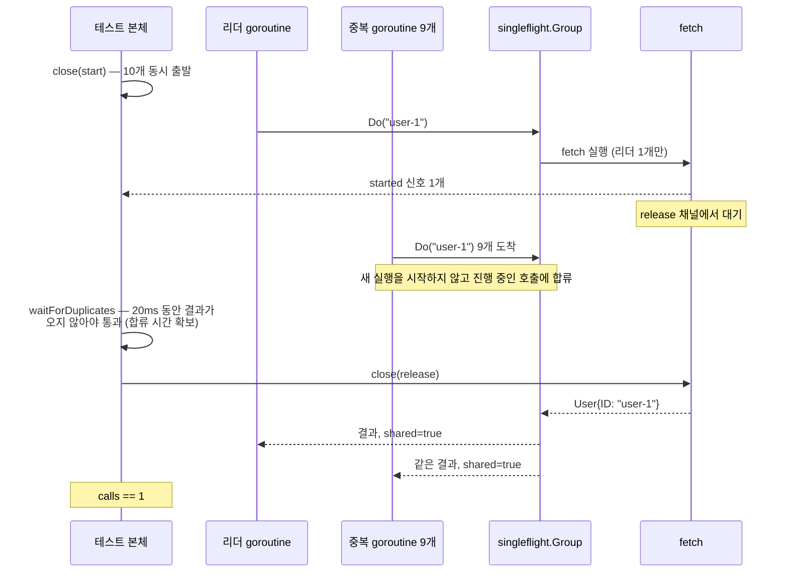
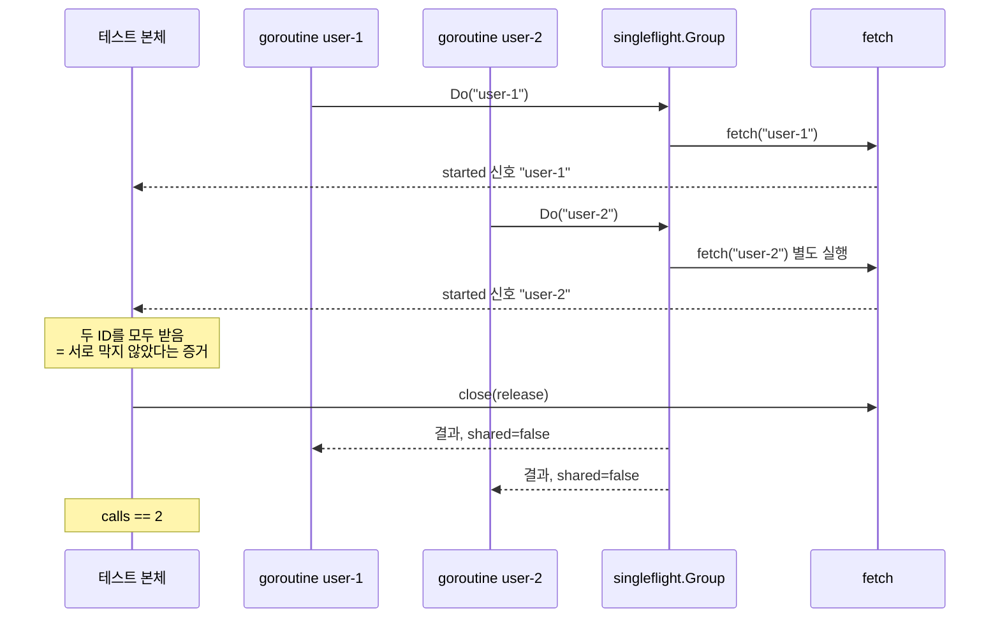
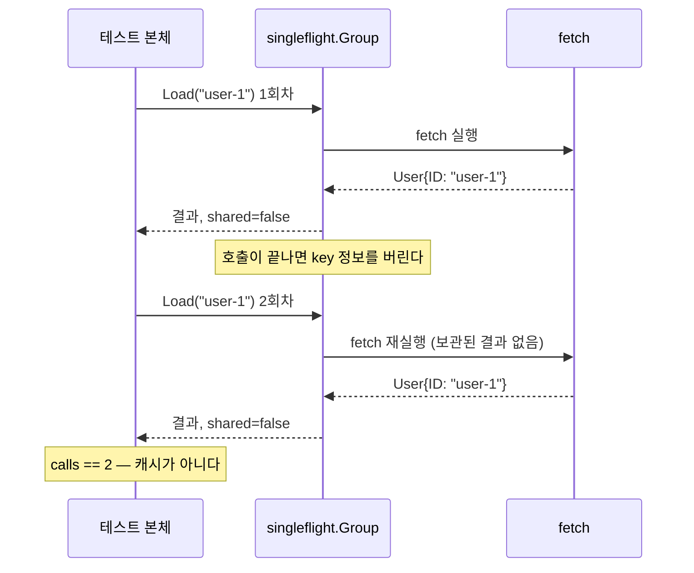
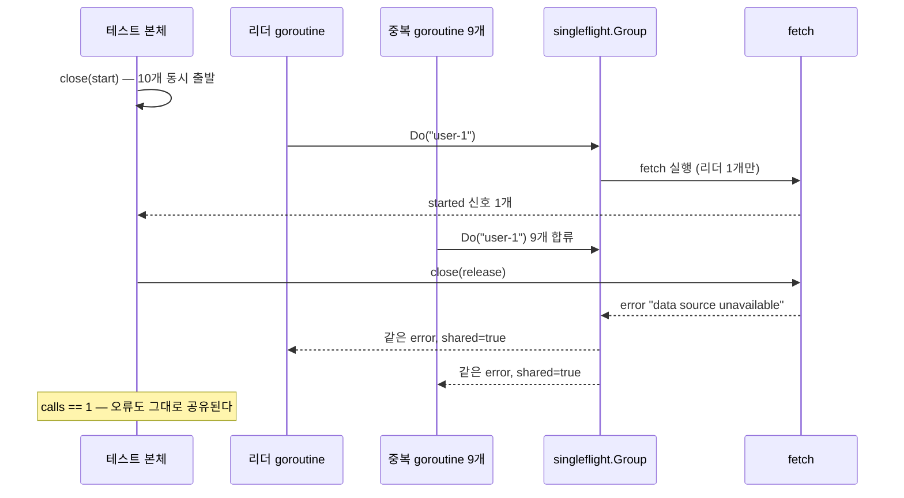

# singleflight로 중복 호출 합치기

`golang.org/x/sync/singleflight`는 같은 key로 동시에 실행되는 함수 호출을 하나로
합친다. 캐시가 비어 있을 때 요청이 한꺼번에 몰려 DB나 외부 API가 반복 호출되는
cache stampede 문제를 완화할 때 유용하다.

```text
적용 전
요청 10개 ──> DB/API 호출 10번

적용 후
요청 10개 ──> singleflight.Group ──> DB/API 호출 1번
                         └──────────> 결과 또는 오류 공유
```

## 핵심 코드

`UserLoader`는 사용자 ID를 key로 사용한다. `user-1`에 대한 조회가 진행 중일 때
같은 ID로 들어온 호출은 새 조회를 시작하지 않고 먼저 시작된 호출의 반환을 기다린다.

```go
value, err, shared := group.Do(userID, func() (any, error) {
	return fetch(userID)
})
```

- `value`: 조회 함수가 반환한 값
- `err`: 조회 함수가 반환한 오류
- `shared`: 결과가 둘 이상의 호출자에게 전달되었는지 여부

`user-1`과 `user-2`처럼 key가 다르면 두 조회는 서로 막지 않고 독립적으로 실행된다.

## 동시 요청 흐름



`요청 1`과 `요청 2`는 key가 같으므로 `fetch("user-1")`을 한 번만 실행한다.
`요청 3`은 key가 다르므로 앞선 요청과 독립적으로 실행된다. `shared`는 결과가 둘
이상의 호출자에게 전달되었는지를 나타내므로 최초 호출자인 `요청 1`에도 `true`가
반환된다.

## 테스트 실행

```bash
go test -race -v ./golang/singleflight
```

테스트에서는 채널로 느린 데이터 소스를 재현하고 `atomic.Int64`로 실제 호출 횟수를
측정한다.

| 테스트 | 확인하는 동작 |
| --- | --- |
| `TestWithoutSingleflightCallsDataSourceForEveryRequest` | 적용 전에는 요청 수만큼 조회한다 |
| `TestUserLoaderCombinesConcurrentCallsForSameKey` | 같은 key의 동시 조회는 한 번만 실행한다 |
| `TestUserLoaderRunsDifferentKeysIndependently` | 다른 key는 각각 실행한다 |
| `TestUserLoaderDoesNotCacheCompletedResult` | 완료된 결과는 보관하지 않는다 |
| `TestUserLoaderSharesErrorWithConcurrentCallers` | 조회 오류도 동시 호출자에게 공유한다 |

## 테스트 흐름

### 테스트가 동시성을 만드는 방법

`go test`는 goroutine이 실제로 겹쳐서 실행되는 시점을 보장하지 않는다. "동시에 요청이
몰린 상황"을 매번 똑같이 재현하려고 테스트는 채널 세 개로 타이밍을 직접 제어한다.

| 채널 | 방향 | 역할 |
| --- | --- | --- |
| `start` | 테스트 → goroutine | `close`로 모든 요청을 같은 시점에 출발시킨다 |
| `started` | fetch → 테스트 | 데이터 소스 호출이 실제로 시작됐음을 테스트에 알린다 |
| `release` | 테스트 → fetch | `close` 전까지 fetch를 붙잡아 느린 조회를 재현한다 |

`close`를 쓰는 이유는 값 송신과 달리 대기 중인 goroutine을 한 번에 모두 깨우기
때문이다. 값을 열 번 보내는 대신 채널을 한 번 닫으면 broadcast가 된다.

`started` 신호를 몇 번 받는지가 곧 데이터 소스가 몇 번 호출됐는지를 뜻하므로,
테스트는 이 신호로 중복 제거 여부를 판별한다.

### 1. 적용 전에는 요청 수만큼 조회한다

`TestWithoutSingleflightCallsDataSourceForEveryRequest`는 `UserLoader`를 거치지 않고
`fetch`를 직접 호출한다. 비교 기준이 되는 "적용 전" 상태다.

```mermaid
sequenceDiagram
    participant T as 테스트 본체
    participant G as goroutine 10개
    participant F as fetch (직접 호출)

    T->>G: goroutine 10개 시작
    G->>F: fetch("user-1") 각자 호출
    Note over F: calls 10 증가<br/>10개 모두 release 채널에서 대기
    F-->>T: started 신호 10개
    Note over T: 신호 10개 = 10개가 동시에 fetch 안에 있다
    T->>F: close(release)
    F-->>G: 10개 각각 결과 반환
    Note over T: calls == 10
```



### 2. 같은 key의 동시 조회는 한 번만 실행한다

`TestUserLoaderCombinesConcurrentCallsForSameKey`는 같은 흐름을 `UserLoader`를 통해
실행한다. 먼저 도착한 goroutine(리더)만 `fetch`에 진입하고 나머지는 그 호출에 합류한다.



`waitForDuplicates`는 두 가지 역할을 한다. 중복 goroutine 9개가 `Group.Do`까지
도달할 시간을 벌어 주고, 그 사이에 결과가 먼저 도착하면 fetch가 예상과 달리 이미
끝났다는 뜻이므로 테스트를 실패시킨다.

### 3. 다른 key는 각각 실행한다

`TestUserLoaderRunsDifferentKeysIndependently`에서는 `started`가 `chan string`이라
어떤 key의 조회가 시작됐는지까지 확인할 수 있다.



각 key를 요청한 호출자가 하나뿐이므로 `shared`는 둘 다 `false`다.

### 4. 완료된 결과는 보관하지 않는다

`TestUserLoaderDoesNotCacheCompletedResult`는 유일하게 동시성이 없는 테스트다.
같은 key를 순차로 두 번 조회한다.



### 5. 조회 오류도 동시 호출자에게 공유한다

`TestUserLoaderSharesErrorWithConcurrentCallers`는 2번과 구조가 같고 `fetch`의
반환값만 오류다.



일시적인 오류 하나가 대기 중인 요청 전부에 전달된다는 뜻이기도 하다. 재시도 정책을
설계할 때 고려해야 할 동작이다.

## 캐시와의 차이

`singleflight`는 캐시가 아니다. 실행 중인 호출만 합치므로 첫 호출이 끝난 뒤 같은
key를 다시 조회하면 함수가 다시 실행된다. 실무에서는 일반적으로 다음 순서로 캐시와
함께 사용한다.

1. 캐시에서 값을 조회한다.
2. cache miss이면 `Group.Do`에 진입한다.
3. 함수 안에서 캐시를 다시 확인한다.
4. 여전히 값이 없으면 원본 데이터를 조회하고 캐시에 저장한다.

함수 안에서 캐시를 다시 확인하는 이유는 `Group.Do`에 진입하기 직전에 다른 요청이
캐시를 채웠을 수 있기 때문이다.

## 사용할 때 주의할 점

- 중복 제거 범위는 하나의 `Group`, 즉 일반적으로 하나의 프로세스 내부다. 여러 서버
  인스턴스 전체의 호출을 하나로 합치지는 않는다.
- key에는 결과에 영향을 주는 조건을 모두 포함해야 한다. 예를 들어 사용자 ID뿐 아니라
  언어에 따라 결과가 달라진다면 `userID + locale`을 key로 사용해야 한다.
- 값뿐 아니라 오류도 공유된다. 일시적인 오류가 동시에 대기 중인 모든 요청에 전달될 수
  있다.
- `Do`는 함수가 끝날 때까지 대기한다. 호출자별 취소나 타임아웃을 선택적으로 처리해야
  한다면 `DoChan`과 `select` 사용을 검토한다.
- 한 호출자의 대기가 취소되더라도 이미 실행 중인 함수가 자동으로 취소되는 것은 아니다.
  내부 작업의 수명과 `context.Context` 정책을 별도로 설계해야 한다.
