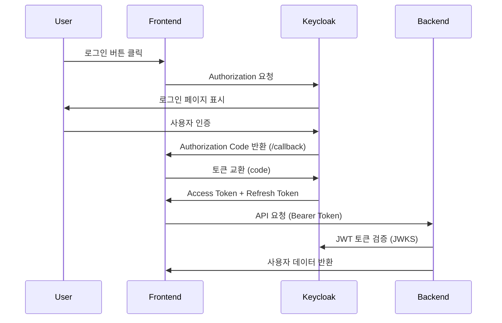

# Keycloak Tutorial Project

Keycloak을 이용한 로그인/로그아웃 샘플 페이지 프로젝트입니다.

## 프로젝트 구조

```
keycloak/
├── backend/          # Go + Echo 백엔드 서버
├── frontend/         # React + TypeScript 프론트엔드
├── docs/            # 프로젝트 문서
│   ├── prd.md       # 프로젝트 요구사항 문서
│   ├── implementation.md  # 구현 가이드
│   └── todo.md      # 작업 목록
└── README.md        # 실행 가이드 (이 파일)
```

## 기술 스택

### Backend
- **언어**: Go 1.25
- **프레임워크**: Echo v4.13.4
- **인증**: JWT 토큰 검증
- **포트**: 8081

### Frontend
- **언어**: TypeScript
- **프레임워크**: React 18
- **라우팅**: React Router DOM
- **인증**: Authorization Code Flow (REST API)
- **HTTP 클라이언트**: Axios
- **포트**: 3000

### 인증 서버
- **Keycloak**: Docker 컨테이너
- **포트**: 8080
- **Realm**: `myrealm`
- **Client**: `myclient`
- **Test User**: `myuser`

## 사전 요구사항

- Docker
- Go 1.25+
- Node.js 18+
- npm

## 실행 방법

### 1. Keycloak 실행

```bash
# Keycloak Docker 컨테이너 실행
docker run -d -p 8080:8080 \
  -e KEYCLOAK_ADMIN=admin \
  -e KEYCLOAK_ADMIN_PASSWORD=admin \
  --name keycloak-tutorial \
  quay.io/keycloak/keycloak:latest start-dev
```

### 2. Keycloak 설정

1. **관리자 콘솔 접속**
   - URL: http://localhost:8080
   - 계정: admin / admin

2. **Realm 생성**
   - Name: `myrealm`

3. **Client 생성**
   - Client ID: `myclient`
   - Client Type: `OpenID Connect`
   - Access Type: `public`
   - Standard Flow Enabled: `ON`
   - Valid redirect URIs: `http://localhost:3000/callback`
   - Valid post logout redirect URIs: `http://localhost:3000/login`
   - Web origins: `http://localhost:3000`

4. **Test User 생성**
   - Username: `myuser`
   - Email: `myuser@example.com`
   - First Name: `My`
   - Last Name: `User`
   - Password: `1234` (또는 원하는 비밀번호)

### 3. Backend 실행

```bash
# backend 디렉토리로 이동
cd backend

# 의존성 설치
go mod tidy

# 서버 실행
go run main.go
```

서버가 정상적으로 실행되면 다음과 같은 메시지가 출력됩니다:
```
   ____    __
  / __/___/ /  ___
 / _// __/ _ \/ _ \
/___/\__/_//_/\___/ v4.13.4
High performance, minimalist Go web framework
https://echo.labstack.com
____________________________________O/_______
                                    O\
⇨ http server started on [::]:8081
```

### 4. Frontend 실행

```bash
# frontend 디렉토리로 이동
cd frontend

# 의존성 설치
npm install

# 개발 서버 실행
npm start
```

브라우저가 자동으로 열리며 http://localhost:3000 에서 앱이 실행됩니다.

## 테스트 시나리오

### 기본 플로우 (Authorization Code Flow)
1. http://localhost:3000 접속
2. "🔐 Keycloak으로 로그인" 버튼 클릭
3. Keycloak 로그인 페이지로 자동 리다이렉트
4. `myuser` / `1234`로 로그인
5. `/callback` 페이지에서 토큰 교환 처리
6. 사용자 정보 페이지(`/profile`)로 자동 이동
7. 사용자 이름, 이메일 정보 확인
8. "Logout" 버튼으로 로그아웃 후 로그인 페이지로 이동

### API 테스트
```bash
# 1. Keycloak에서 토큰 획득 (실제로는 프론트엔드에서 자동 처리)
# 2. 토큰을 사용하여 API 호출
curl -H "Authorization: Bearer YOUR_JWT_TOKEN" \
     http://localhost:8081/api/user
```

## 주요 엔드포인트

### Backend API
- `GET /health` - 서버 상태 확인
- `GET /api/user` - 인증된 사용자 정보 조회 (JWT 토큰 필요)

### Frontend Routes
- `/` - 루트 (로그인 상태에 따라 리다이렉트)
- `/login` - 로그인 페이지 (Authorization Code Flow)
- `/callback` - OAuth 콜백 페이지 (토큰 교환 처리)
- `/profile` - 사용자 프로필 페이지 (보호된 라우트)

### Keycloak
- `http://localhost:8080` - Keycloak 관리자 콘솔
- `http://localhost:8080/realms/myrealm/protocol/openid-connect/certs` - JWKS 엔드포인트

## 트러블슈팅

### 포트 충돌
```bash
# 포트 사용 중인 프로세스 확인 및 종료
lsof -ti:8080 | xargs kill -9  # Keycloak
lsof -ti:8081 | xargs kill -9  # Backend
lsof -ti:3000 | xargs kill -9  # Frontend
```

### Docker 컨테이너 관리
```bash
# 컨테이너 상태 확인
docker ps -a | grep keycloak

# 컨테이너 중지
docker stop keycloak-tutorial

# 컨테이너 재시작
docker start keycloak-tutorial

# 컨테이너 제거
docker rm keycloak-tutorial
```

### 로그 확인
```bash
# Backend 로그 (실행 중인 터미널에서 확인)
# Frontend 로그 (브라우저 개발자 도구 Console 탭)
# Keycloak 로그
docker logs keycloak-tutorial
```

### 인증 관련 문제

**400 Bad Request (unauthorized_client)**
```
원인: Direct Access Grants가 비활성화됨
해결: Keycloak 클라이언트 설정에서 "Standard Flow Enabled: ON" 확인
```

**리다이렉트 오류**
```
원인: Valid Redirect URIs 설정 오류
해결: http://localhost:3000/callback 정확히 설정
```

**토큰 교환 실패**
```
원인: Authorization Code 만료 또는 재사용
해결: 새로 로그인 시도, 브라우저 개발자 도구에서 콘솔 확인
```

**CORS 오류**
```
원인: Web Origins 설정 누락
해결: Keycloak 클라이언트에서 http://localhost:3000 추가
```

## 인증 구현 방식

### 간단한 OAuth 2.0 구현

이 프로젝트는 **Keycloak 라이브러리 대신 REST API**를 사용하여 최소한의 OAuth 2.0 Authorization Code Flow를 구현합니다. 

- Keycloak에서 말하는 Standard Flow = OAuth 2.0 / OpenID Connect의 Authorization Code Flow 입니다. 

#### 🔑 Authorization Code Flow (표준 OAuth 2.0 용어)
- RFC 6749 (OAuth 2.0 표준)에서 정의된 방식
- 주로 웹 애플리케이션(특히 서버-사이드 렌더링 앱)에서 사용
- 동작:
  1. 사용자가 클라이언트(앱) → 인증 서버(Keycloak)로 리디렉션됨
  2. 로그인 성공 후, 인증 서버가 authorization code를 redirect URI로 전달 
  3. 클라이언트가 이 코드를 이용해 토큰 엔드포인트로 Access Token + Refresh Token 요청 
  4. 응답으로 JWT(Access Token, ID Token 등)를 받음

#### 주요 특징
- ✅ **최소 구현**: 핵심 기능만으로 OAuth 2.0 구현
- ✅ **라이브러리 독립성**: keycloak-js 라이브러리 없이 구현
- ✅ **학습 친화적**: 복잡한 보안 로직 없이 기본 플로우에 집중
- ✅ **토큰 관리**: 자동 토큰 갱신 및 만료 처리

#### 인증 플로우


#### 구현된 기능

**AuthService 클래스**
- `initiateLogin()`: Keycloak 로그인 페이지로 리다이렉트
- `handleCallback()`: Authorization Code를 Access Token으로 교환
- `refreshAccessToken()`: 토큰 자동 갱신
- `getUserInfo()`: Keycloak UserInfo 엔드포인트 호출
- `logout()`: Keycloak 로그아웃 및 로컬 토큰 정리

**컴포넌트**
- `Login`: 단일 로그인 버튼 (Authorization Code Flow)
- `Callback`: OAuth 콜백 처리 및 토큰 교환
- `ProtectedRoute`: 인증 상태 기반 라우트 보호
- `UserProfile`: 사용자 정보 표시 및 로그아웃

**API 통신**
- Axios 인터셉터를 통한 자동 토큰 추가
- 401 에러 시 자동 토큰 갱신 시도
- 토큰 갱신 실패 시 로그인 페이지로 리다이렉트

## 보안 고려사항

- ✅ **토큰 저장**: localStorage 사용 (프로덕션에서는 httpOnly 쿠키 권장)
- ✅ **토큰 만료**: 자동 갱신 및 만료 처리
- ⚠️ **HTTP 통신**: 로컬 개발용 (프로덕션에서는 HTTPS 필수)
- ⚠️ **최소 보안**: 학습 목적으로 CSRF/PKCE 보호 제거
- ⚠️ **Public Client**: 간단한 구현 (학습/개발용)
- ⚠️ **프로덕션 사용 금지**: 실제 서비스에서는 추가 보안 조치 필요

## 참고 문서

- [PRD 문서](docs/prd.md) - 프로젝트 요구사항
- [구현 가이드](docs/implementation.md) - 상세 구현 내용
- [작업 목록](docs/todo.md) - 개발 진행 상황

## 라이선스

이 프로젝트는 학습 목적으로 작성되었습니다.
