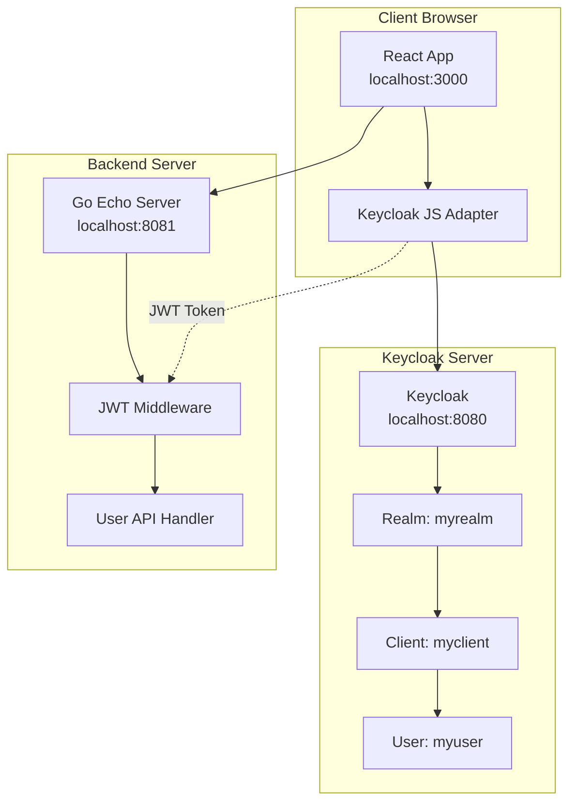
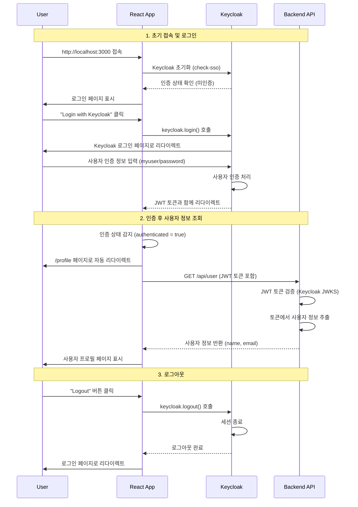
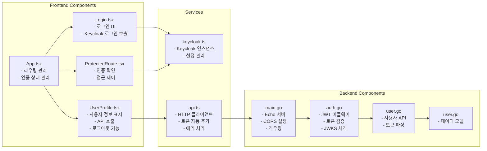

# Implementation Guide

## 시스템 아키텍처 다이어그램

### 1. 전체 시스템 구조



### 2. 인증 플로우 시퀀스



### 3. 컴포넌트 구조



## 주요 구현 포인트

### Frontend (React + TypeScript)
1. **인증 상태 관리**: `useState`와 `useEffect`를 사용하여 실시간 인증 상태 감지
2. **자동 리다이렉트**: 로그인 성공 시 `/profile`로, 미인증 시 `/login`으로 자동 이동
3. **토큰 관리**: Axios 인터셉터를 통한 자동 JWT 토큰 추가
4. **에러 처리**: 401 에러 시 자동 재로그인 처리

### Backend (Go + Echo)
1. **JWT 검증**: Keycloak JWKS 엔드포인트에서 공개키를 가져와 토큰 검증
2. **미들웨어**: 모든 보호된 API에 JWT 검증 미들웨어 적용
3. **CORS 설정**: 로컬 개발을 위한 CORS 허용
4. **사용자 정보 추출**: JWT 클레임에서 사용자 정보 파싱

### Keycloak 설정
1. **Realm**: `myrealm` - 독립적인 인증 영역
2. **Client**: `myclient` - React 앱을 위한 OpenID Connect 클라이언트
3. **User**: `myuser` - 테스트용 사용자 계정
4. **Redirect URI**: React 앱의 URL 허용

## 1. Keycloak 설정

### Docker로 Keycloak 실행
```bash
docker run -p 8080:8080 -e KEYCLOAK_ADMIN=admin -e KEYCLOAK_ADMIN_PASSWORD=admin quay.io/keycloak/keycloak:latest start-dev
```

### Realm 및 Client 설정
1. **Realm 생성**
   - Name: `myrealm`

2. **Client 생성**
   - Client ID: `myclient`
   - Client Type: `OpenID Connect`
   - Valid redirect URIs: `http://localhost:3000/*`
   - Web origins: `http://localhost:3000`

3. **Test User 생성**
   - Username: `myuser`
   - Email: `myuser@example.com`
   - First Name: `My`
   - Last Name: `User`
   - Password: `password`

## 2. Backend 구현 (Go + Echo)

### 프로젝트 구조
```
backend/
├── main.go
├── handlers/
│   └── user.go
├── middleware/
│   └── auth.go
├── models/
│   └── user.go
└── go.mod
```

### 주요 의존성
```go
// go.mod
module keycloak-tutorial-backend

go 1.25

require (
    github.com/labstack/echo/v4 v4.12.0
    github.com/golang-jwt/jwt/v5 v5.2.1
    github.com/lestrrat-go/jwx/v2 v2.1.3
)
```

### 핵심 구현 사항

#### 1. JWT 토큰 검증 미들웨어
```go
// middleware/auth.go
func JWTMiddleware() echo.MiddlewareFunc {
    return func(next echo.HandlerFunc) echo.HandlerFunc {
        return func(c echo.Context) error {
            // Authorization 헤더에서 토큰 추출
            // Keycloak public key로 토큰 검증
            // 사용자 정보를 context에 저장
        }
    }
}
```

#### 2. 사용자 정보 핸들러
```go
// handlers/user.go
func GetUserInfo(c echo.Context) error {
    // JWT 토큰에서 사용자 정보 추출
    // 이름, 이메일 반환
}
```

#### 3. 메인 서버
```go
// main.go
func main() {
    e := echo.New()
    
    // CORS 미들웨어 (로컬 개발용)
    e.Use(middleware.CORSWithConfig(middleware.CORSConfig{
        AllowOrigins: []string{"http://localhost:3000"},
        AllowMethods: []string{echo.GET, echo.POST, echo.PUT, echo.DELETE},
        AllowHeaders: []string{echo.HeaderOrigin, echo.HeaderContentType, echo.HeaderAccept, echo.HeaderAuthorization},
    }))
    
    // 보호된 라우트
    protected := e.Group("/api")
    protected.Use(JWTMiddleware())
    protected.GET("/user", handlers.GetUserInfo)
    
    e.Logger.Fatal(e.Start(":8081"))
}
```

## 3. Frontend 구현 (React)

### 프로젝트 구조
```
frontend/
├── public/
├── src/
│   ├── components/
│   │   ├── Login.jsx
│   │   ├── UserProfile.jsx
│   │   └── ProtectedRoute.jsx
│   ├── services/
│   │   ├── keycloak.js
│   │   └── api.js
│   ├── App.js
│   └── index.js
├── package.json
└── README.md
```

### 주요 의존성
```json
{
  "dependencies": {
    "react": "^18.2.0",
    "react-dom": "^18.2.0",
    "react-router-dom": "^6.8.0",
    "keycloak-js": "^23.0.0",
    "axios": "^1.6.0"
  }
}
```

### 핵심 구현 사항

#### 1. Keycloak 설정
```javascript
// services/keycloak.js
import Keycloak from 'keycloak-js';

const keycloak = new Keycloak({
  url: 'http://localhost:8080',
  realm: 'myrealm',
  clientId: 'myclient'
});

export default keycloak;
```

#### 2. API 서비스
```javascript
// services/api.js
import axios from 'axios';
import keycloak from './keycloak';

const api = axios.create({
  baseURL: 'http://localhost:8081/api'
});

// 요청 인터셉터로 토큰 자동 추가
api.interceptors.request.use((config) => {
  if (keycloak.token) {
    config.headers.Authorization = `Bearer ${keycloak.token}`;
  }
  return config;
});

export const getUserInfo = () => api.get('/user');
```

#### 3. 보호된 라우트 컴포넌트
```javascript
// components/ProtectedRoute.jsx
import { Navigate } from 'react-router-dom';
import keycloak from '../services/keycloak';

const ProtectedRoute = ({ children }) => {
  return keycloak.authenticated ? children : <Navigate to="/login" />;
};
```

#### 4. 사용자 프로필 컴포넌트
```javascript
// components/UserProfile.jsx
import { useState, useEffect } from 'react';
import { getUserInfo } from '../services/api';
import keycloak from '../services/keycloak';

const UserProfile = () => {
  const [userInfo, setUserInfo] = useState(null);
  
  useEffect(() => {
    fetchUserInfo();
  }, []);
  
  const fetchUserInfo = async () => {
    try {
      const response = await getUserInfo();
      setUserInfo(response.data);
    } catch (error) {
      console.error('Failed to fetch user info:', error);
    }
  };
  
  const handleLogout = () => {
    keycloak.logout();
  };
  
  return (
    <div>
      <h2>User Profile</h2>
      {userInfo && (
        <div>
          <p>Name: {userInfo.name}</p>
          <p>Email: {userInfo.email}</p>
        </div>
      )}
      <button onClick={handleLogout}>Logout</button>
    </div>
  );
};
```

#### 5. 메인 App 컴포넌트
```javascript
// App.js
import { BrowserRouter as Router, Routes, Route } from 'react-router-dom';
import { useState, useEffect } from 'react';
import keycloak from './services/keycloak';
import Login from './components/Login';
import UserProfile from './components/UserProfile';
import ProtectedRoute from './components/ProtectedRoute';

function App() {
  const [keycloakInitialized, setKeycloakInitialized] = useState(false);
  
  useEffect(() => {
    keycloak.init({ onLoad: 'check-sso' })
      .then((authenticated) => {
        setKeycloakInitialized(true);
      })
      .catch((error) => {
        console.error('Keycloak initialization failed:', error);
      });
  }, []);
  
  if (!keycloakInitialized) {
    return <div>Loading...</div>;
  }
  
  return (
    <Router>
      <div className="App">
        <Routes>
          <Route path="/login" element={<Login />} />
          <Route 
            path="/profile" 
            element={
              <ProtectedRoute>
                <UserProfile />
              </ProtectedRoute>
            } 
          />
          <Route path="/" element={<Login />} />
        </Routes>
      </div>
    </Router>
  );
}
```

## 4. 환경 설정

### Backend 환경 변수
```bash
# .env
KEYCLOAK_URL=http://localhost:8080
KEYCLOAK_REALM=myrealm
KEYCLOAK_CLIENT_ID=myclient
SERVER_PORT=8081
```

### Frontend 환경 변수
```bash
# .env
REACT_APP_KEYCLOAK_URL=http://localhost:8080
REACT_APP_KEYCLOAK_REALM=myrealm
REACT_APP_KEYCLOAK_CLIENT_ID=myclient
REACT_APP_API_URL=http://localhost:8081/api
```

## 5. 실행 순서

1. **Keycloak 실행**
   ```bash
   docker run -p 8080:8080 -e KEYCLOAK_ADMIN=admin -e KEYCLOAK_ADMIN_PASSWORD=admin quay.io/keycloak/keycloak:latest start-dev
   ```

2. **Keycloak 설정** (웹 콘솔에서)
   - Realm, Client, User 생성

3. **Backend 실행**
   ```bash
   cd backend
   go mod tidy
   go run main.go
   ```

4. **Frontend 실행**
   ```bash
   cd frontend
   npm install
   npm start
   ```
   ㅇ

## 6. 테스트 시나리오

### 기본 플로우 테스트
1. `http://localhost:3000` 접속
2. 로그인 페이지에서 Keycloak 로그인
3. 사용자 정보 페이지에서 이름, 이메일 확인
4. 로그아웃 버튼으로 로그아웃

### 토큰 만료 테스트
1. 로그인 후 브라우저 개발자 도구에서 토큰 확인
2. 토큰 만료 시간 대기 또는 수동으로 토큰 삭제
3. API 호출 시 401 에러 확인
4. 자동 로그아웃 또는 재로그인 프롬프트 확인

### 에러 처리 테스트
1. 잘못된 사용자 정보로 로그인 시도
2. 네트워크 오류 시뮬레이션
3. Backend 서버 중단 상태에서 API 호출
