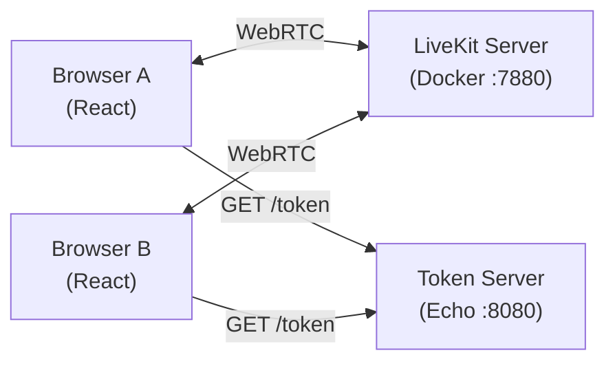

# WebRTC 다자간 화상 통화 - LiveKit SFU

LiveKit을 활용한 다자간 화상 통화 + 채팅 예제입니다.

기존 [multi-users-sfu-pion](../multi-users-sfu-pion)에서 Pion으로 직접 구현했던 SFU를 LiveKit 서버로 대체하여, 코드가 얼마나 간소화되는지 비교할 수 있습니다.

## Pion SFU vs LiveKit 비교

| 구분 | Pion SFU (직접 구현) | LiveKit |
|------|---------------------|---------|
| 시그널링 서버 | 직접 구현 (WebSocket + SDP/ICE 교환) | LiveKit 서버가 처리 |
| SFU 로직 | `handler/signaling.go` + `room/manager.go` + `sfu/peer.go` (~520줄) | LiveKit 서버가 처리 |
| 백엔드 코드 | ~520줄 (시그널링, 룸 관리, 트랙 포워딩) | ~40줄 (토큰 발급 API만) |
| 프론트엔드 훅 | `useSignaling.ts` + `useWebRTC.ts` (~190줄) | `useRoom.ts` (~130줄) |
| 재협상 (Renegotiation) | 직접 구현 | LiveKit SDK가 처리 |
| ICE 후보 교환 | 직접 구현 | LiveKit SDK가 처리 |
| 트랙 포워딩 | RTP 패킷 직접 복사 | LiveKit 서버가 처리 |

### 제거된 파일

- `handler/signaling.go` (277줄) - LiveKit 서버가 시그널링 처리
- `room/manager.go` (117줄) - LiveKit 서버가 룸 관리
- `sfu/peer.go` (123줄) - LiveKit 서버가 피어 연결 관리
- `useSignaling.ts` (88줄) - LiveKit SDK가 시그널링 처리
- `useWebRTC.ts` (103줄) - LiveKit SDK가 WebRTC 처리

## 시스템 구조



- **LiveKit Server**: SFU 역할. 미디어 라우팅, 시그널링, 룸 관리 모두 처리
- **Token Server**: JWT 토큰 발급만 담당 (API Key/Secret으로 서명)
- **Frontend**: `livekit-client` SDK로 LiveKit 서버에 직접 연결

## 기술 스택

### Backend
- Go 1.25
- Echo v4 (HTTP 서버)
- `github.com/livekit/protocol/auth` (JWT 토큰 생성)

### Frontend
- React 19 + TypeScript
- Vite 7
- `livekit-client` (LiveKit JavaScript SDK)

### Infrastructure
- LiveKit Server (Docker)

## 실행 방법

### 1. LiveKit 서버 시작

```bash
make run-livekit
```

LiveKit 서버가 Docker로 실행됩니다:
- WebSocket: `ws://localhost:7880`
- RTC: `:7881` (TCP), `:7882` (UDP)
- API Key: `devkey`, Secret: `secret`

### 2. 백엔드 실행

```bash
make run-be
```

토큰 서버가 `:8080`에서 시작됩니다.

### 3. 프론트엔드 실행

```bash
make install-fe
make run-fe
```

`http://localhost:5173`에서 프론트엔드가 시작됩니다.

### 4. 테스트

1. 브라우저 탭 2개를 열고 `http://localhost:5173` 접속
2. 같은 Room ID로 입장 (기본값: `room-123`)
3. 카메라/마이크 권한 허용
4. 상대방 영상이 표시되고 채팅 가능

### 종료

```bash
make stop-livekit
```

## 프로젝트 구조

```
webrtc/multi-users-sfu-livekit/
├── Makefile                       # 실행 스크립트
├── README.md
├── backend/
│   ├── go.mod
│   └── main.go                    # 토큰 발급 API (~40줄)
└── frontend/
    ├── index.html
    ├── package.json
    ├── tsconfig.json
    ├── tsconfig.app.json
    ├── tsconfig.node.json
    ├── vite.config.ts
    └── src/
        ├── main.tsx
        ├── index.css
        ├── App.tsx                # Room 입장 UI + 화상 통화 화면
        ├── hooks/
        │   └── useRoom.ts         # LiveKit Room 연결 + 트랙 관리
        └── components/
            ├── VideoGrid.tsx      # 영상 그리드
            └── ChatPanel.tsx      # 채팅 패널 (DataChannel)
```

## API

### GET /token

LiveKit 접속용 JWT 토큰을 발급합니다.

**Parameters:**
| 파라미터 | 타입 | 설명 |
|----------|------|------|
| `roomId` | string | 입장할 방 이름 |
| `userName` | string | 사용자 이름 (identity) |

**Response:**
```json
{
  "token": "eyJhbGciOiJIUzI1NiIs..."
}
```

## 참고 자료

- [LiveKit Docs](https://docs.livekit.io)
- [livekit-client SDK](https://github.com/livekit/client-sdk-js)
- [livekit/server-sdk-go](https://github.com/livekit/server-sdk-go)
- [Pion SFU 직접 구현 예제](../multi-users-sfu-pion)
