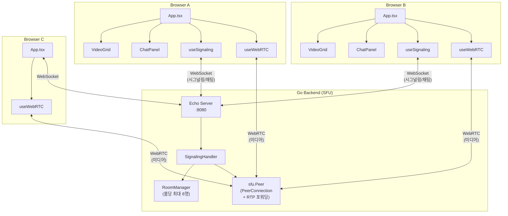
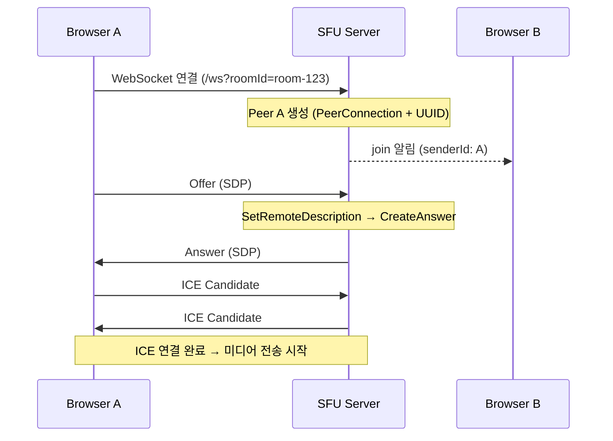
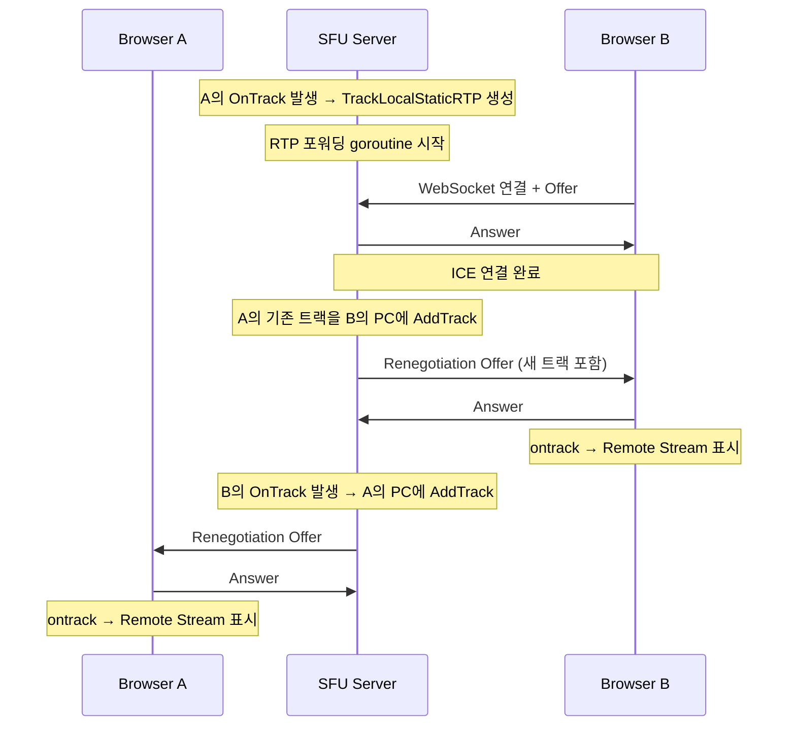
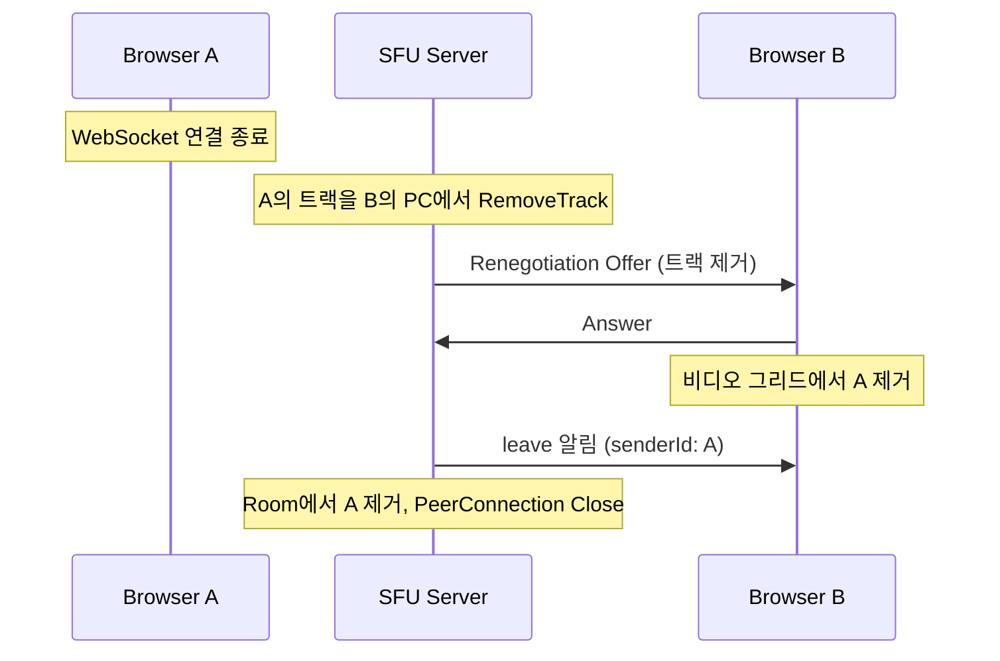

# WebRTC SFU 다자간 화상 통화

Pion WebRTC 기반 SFU(Selective Forwarding Unit) 서버를 활용한 다자간 영상 통화 및 텍스트 채팅 애플리케이션입니다.

> 1:1 P2P 버전은 [webrtc/simple-p2p](../simple-p2p/)를 참고하세요.

## 기술 스택

| 구분 | 기술 |
|------|------|
| Backend | Go, Echo v4, Gorilla WebSocket, Pion WebRTC v4 |
| Frontend | React 18, TypeScript, Vite |
| 프로토콜 | WebSocket (시그널링/채팅), WebRTC (SFU 미디어) |

## P2P vs SFU 비교

| 항목 | P2P (simple-p2p) | SFU (multi-users-sfu-pion) |
|------|-------------------|------------------------|
| 최대 인원 | 2명 | 6명 |
| 미디어 경로 | 브라우저 ↔ 브라우저 | 브라우저 ↔ SFU 서버 ↔ 브라우저 |
| 채팅 방식 | DataChannel (P2P) | WebSocket Broadcast |
| 서버 역할 | 시그널링 릴레이만 | 시그널링 + RTP 패킷 포워딩 |
| PeerConnection | 클라이언트당 1개 (상대와 직접) | 클라이언트당 1개 (SFU와) |

## 프로젝트 구조

```
webrtc/multi-users-sfu-pion/
├── Makefile
├── backend/
│   ├── main.go                      # Echo 서버 설정 (CORS, WebSocket 엔드포인트)
│   ├── handler/
│   │   └── signaling.go            # WebSocket Signaling + SFU 연동
│   ├── room/
│   │   └── manager.go              # Room 관리 (최대 6명, Join/Leave/Broadcast)
│   └── sfu/
│       └── peer.go                 # Peer 구조체 (PeerConnection + 트랙 관리)
└── frontend/
    └── src/
        ├── App.tsx                  # Room 입장 화면 + 통화 화면
        ├── components/
        │   ├── VideoGrid.tsx       # 다자간 비디오 그리드 (동적 레이아웃)
        │   └── ChatPanel.tsx       # WebSocket 채팅 (발신자 이름 표시)
        └── hooks/
            ├── useSignaling.ts     # WebSocket 연결 + 채팅 메시지 관리
            └── useWebRTC.ts        # SFU PeerConnection + Renegotiation 처리
```

## 핵심 개념: SFU (Selective Forwarding Unit)

### SFU란?

SFU는 각 클라이언트에서 보낸 미디어 스트림을 **트랜스코딩 없이** 다른 클라이언트에게 그대로 전달(포워딩)하는 서버입니다.

- **P2P 방식**: N명이면 각 클라이언트가 N-1개의 연결 필요 → 대역폭 폭증
- **SFU 방식**: 각 클라이언트는 SFU 서버와 1개의 연결만 유지 → 서버가 분배

### RTP 포워딩

SFU의 핵심은 **RTP 패킷 포워딩**입니다:

1. 클라이언트 A가 영상/음성 트랙을 SFU에 전송
2. SFU가 `TrackLocalStaticRTP`로 로컬 트랙 생성
3. 이 로컬 트랙을 다른 클라이언트(B, C, ...)의 PeerConnection에 추가
4. goroutine에서 `remoteTrack.Read()` → `localTrack.Write()` 루프로 RTP 포워딩

### Renegotiation

다자간 통화에서 참가자가 입장/퇴장하면 트랙이 추가/제거됩니다. 이때 SFU가 기존 클라이언트와 **SDP 재협상(Renegotiation)** 을 수행합니다:

1. SFU가 새 Offer 생성 → 클라이언트에 전송
2. 클라이언트가 자동으로 Answer 생성 → SFU에 응답
3. 새 트랙이 `ontrack` 이벤트로 전달되어 화면에 표시

## 시스템 아키텍처



## 동작 방식

### 1단계: Room 입장 및 시그널링 연결



### 2단계: 새 참가자 입장 및 트랙 포워딩



### 3단계: 참가자 퇴장 및 정리



## 메시지 프로토콜

### Client → Server

| type | 용도 | payload |
|------|------|---------|
| `offer` | SDP Offer 전송 | `RTCSessionDescription` |
| `answer` | SDP Answer 응답 (renegotiation) | `RTCSessionDescription` |
| `ice` | ICE Candidate 전송 | `RTCIceCandidate` |
| `chat` | 채팅 메시지 | `senderName`, `message` |

### Server → Client

| type | 용도 | payload |
|------|------|---------|
| `offer` | Renegotiation Offer | `RTCSessionDescription` |
| `answer` | SDP Answer 응답 | `RTCSessionDescription` |
| `ice` | ICE Candidate 전송 | `RTCIceCandidate` |
| `join` | 새 참가자 입장 알림 | `senderId` |
| `leave` | 참가자 퇴장 알림 | `senderId` |
| `chat` | 채팅 메시지 브로드캐스트 | `senderId`, `senderName`, `message` |

## 실행 방법

### 사전 요구사항

- Go 1.24+
- Node.js
- WebRTC 지원 브라우저 (Chrome, Firefox, Edge, Safari)

### 실행

```bash
# 터미널 1 - Backend (localhost:8080)
make run-be

# 터미널 2 - Frontend (localhost:5173)
make install-fe  # 최초 1회
make run-fe
```

### 사용법

1. 브라우저에서 `http://localhost:5173` 접속
2. 이름(선택)과 Room ID를 입력하고 **입장** 클릭
3. 다른 브라우저 탭에서 같은 Room ID로 입장 → 자동으로 영상 연결
4. 우측 채팅 패널에서 텍스트 메시지 전송
5. 최대 6명까지 동시 입장 가능
