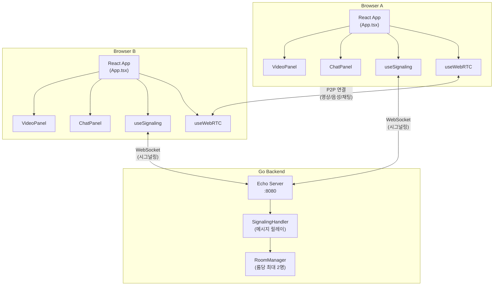
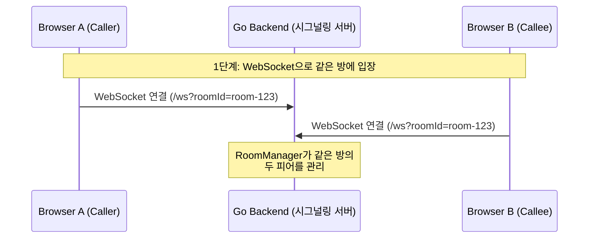
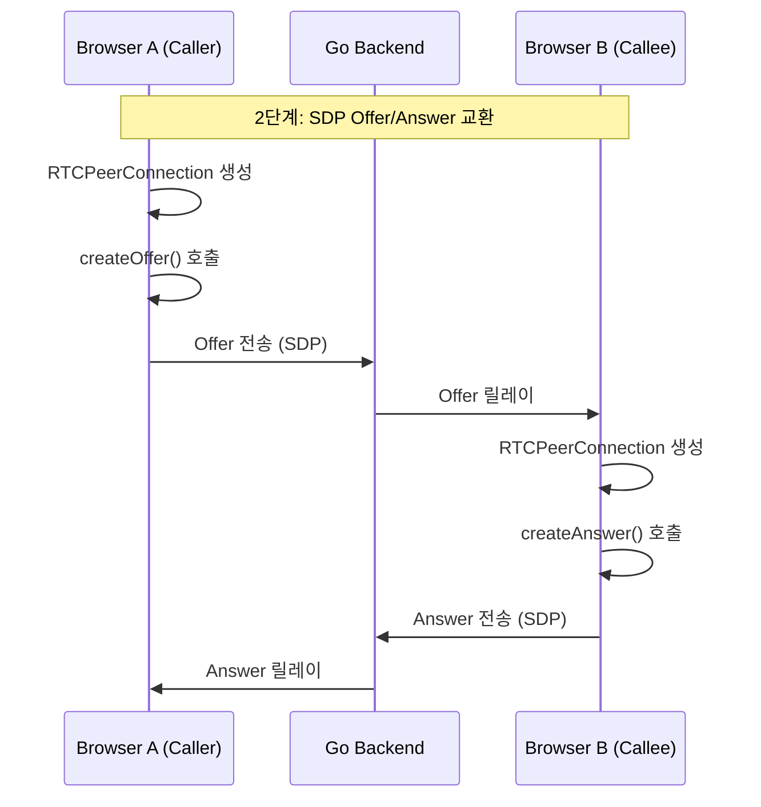
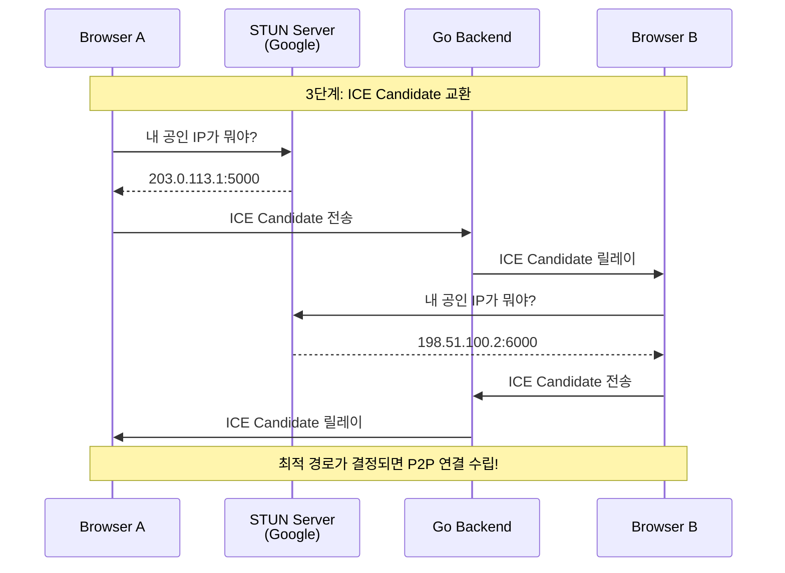
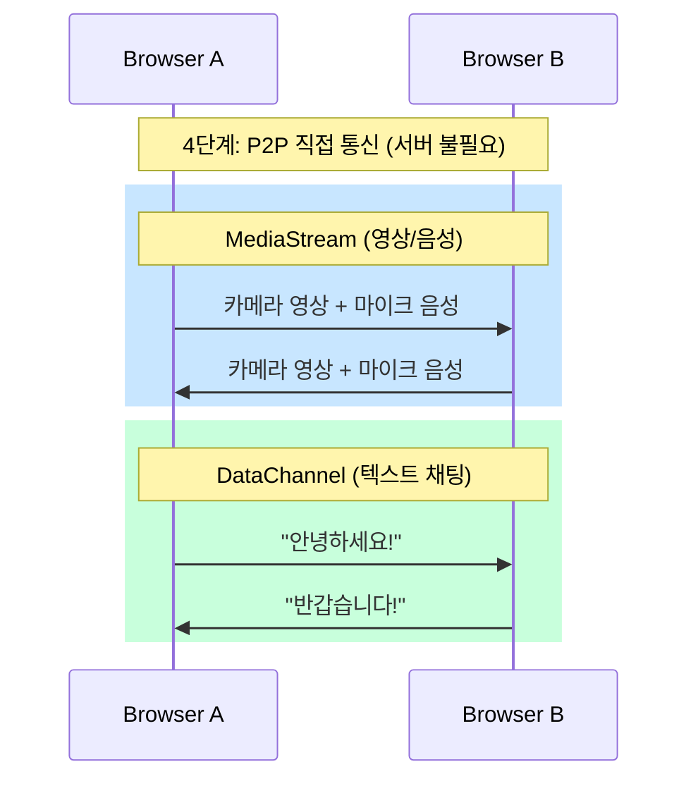

# WebRTC 1:1 Video Chat

WebRTC를 활용한 1:1 영상 통화 및 텍스트 채팅 애플리케이션입니다.

## 기술 스택

| 구분 | 기술 |
|------|------|
| Backend | Go, Echo v4, Gorilla WebSocket |
| Frontend | React 19, TypeScript, Vite |
| 프로토콜 | WebSocket (시그널링), WebRTC (P2P 미디어/데이터) |

## 프로젝트 구조

```
webrtc/
├── Makefile
├── backend/
│   ├── main.go                      # Echo 서버 설정 (CORS, WebSocket 엔드포인트)
│   ├── handler/
│   │   └── signaling.go            # WebSocket 메시지 릴레이
│   └── room/
│       └── manager.go              # 룸 상태 관리 (최대 2명)
└── frontend/
    └── src/
        ├── App.tsx                  # 메인 컴포넌트 (룸 입장 + 영상 통화 UI)
        ├── components/
        │   ├── VideoPanel.tsx       # 로컬/리모트 비디오 표시
        │   └── ChatPanel.tsx        # 텍스트 채팅 UI
        └── hooks/
            ├── useSignaling.ts      # WebSocket 연결 관리
            └── useWebRTC.ts         # RTCPeerConnection 및 DataChannel 관리
```

## 핵심 용어 정리

WebRTC 관련 용어가 낯설 수 있어서, 이 프로젝트에서 사용하는 핵심 개념을 먼저 정리합니다.

**연결 수립에 필요한 것들**
- **WebRTC** - 브라우저 간 영상/음성/데이터를 서버 없이 직접 주고받는 기술
- **P2P (Peer-to-Peer)** - 서버를 거치지 않고 두 기기가 직접 통신하는 방식
- **시그널링** - 연결 전에 상대방 정보를 교환하는 과정. WebRTC 표준에 포함되지 않아 직접 구현 필요 (이 프로젝트에서는 Go Backend가 담당)
- **SDP (Session Description Protocol)** - 내가 지원하는 코덱, 해상도 등 미디어 능력을 기술한 텍스트. "나는 1080p 영상, AAC 오디오 가능해"와 같은 자기소개서
- **Offer/Answer** - Caller가 SDP Offer를 보내면 Callee가 SDP Answer로 응답하는 협상 과정
- **ICE Candidate** - 상대방과 연결 가능한 네트워크 경로 후보 (IP + 포트)
- **STUN 서버** - 공유기(NAT) 뒤에 있는 기기의 공인 IP를 알려주는 외부 서버
- **RTCPeerConnection** - WebRTC 연결을 관리하는 브라우저 API 객체

**연결 후 데이터 전송**
- **MediaStream** - 카메라/마이크에서 캡처한 영상/음성 데이터 스트림
- **DataChannel** - P2P로 텍스트/파일 등 임의의 데이터를 주고받는 채널

## 시스템 아키텍처



## 동작 방식

### 1단계: 시그널링 - 서로를 찾는 과정

WebRTC에서 두 브라우저가 직접 통신하려면 먼저 **상대방의 연결 정보를 교환**해야 합니다. 브라우저끼리는 서로를 직접 찾을 수 없기 때문에 Go Backend가 **중개 서버(시그널링 서버)** 역할을 합니다.



### 2단계: Offer/Answer - 연결 조건 협상

Caller가 "나는 이런 영상/음성을 보낼 수 있어"라는 **Offer**를 보내면, Callee가 "나는 이렇게 받을 수 있어"라는 **Answer**로 응답합니다. 이 과정을 **SDP(Session Description Protocol) 교환**이라고 합니다.



### 3단계: ICE Candidate - 최적 경로 탐색

양쪽 브라우저가 서로 연결할 수 있는 **네트워크 경로 후보(ICE Candidate)** 를 교환합니다. STUN 서버를 통해 자신의 공인 IP를 알아내고, 가능한 모든 경로를 상대에게 알려줍니다.



### 4단계: P2P 통신 - 서버 없이 직접 연결

연결이 수립되면 **영상/음성은 MediaStream**, **텍스트 채팅은 DataChannel**을 통해 브라우저 간 직접 전달됩니다. 이 단계에서는 Go Backend를 거치지 않습니다.



## 실행 방법

### 사전 요구사항

- Go 1.24+
- Node.js
- WebRTC 지원 브라우저 (Chrome, Firefox, Edge, Safari)

### 실행

```bash
# 터미널 1 - Backend (localhost:8080)
make run-be

# 터미널 2 - Frontend (localhost:5173)
make install-fe  # 최초 1회
make run-fe
```

### 사용법

1. 브라우저에서 `http://localhost:5173` 접속
2. Room ID를 입력하고 **입장** 클릭
3. 다른 브라우저 탭에서 같은 Room ID로 입장
4. **통화 시작** 버튼을 클릭하여 영상 통화 시작
5. 우측 채팅 패널에서 텍스트 메시지 전송
